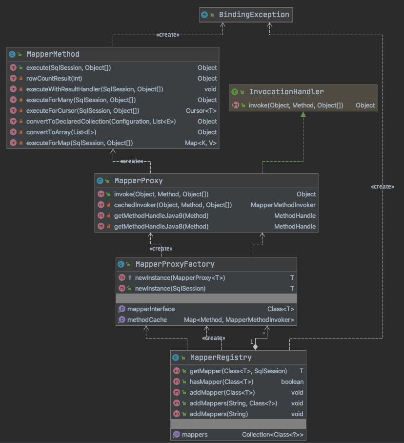

------


## **MyBatis源码解析之基础模块—binding**


### binding未诞生之暗黑时代

在介绍MyBatis的binding之前，咱们先一段代码：

**UserInfoDAO**

```java
package com.todobugs.study.dao;

import com.todobugs.study.domain.UserInfo;
import com.todobugs.study.query.UserInfoQuery;

public interface UserInfoDAO {
    Long insert(UserInfo userInfo);
    /**
     * 根据用户名查找
     * @param userName
     * @return
     */
    UserInfo selectUserInfoByName(String userName);
}
```

**UserInfoDaoImpl**

```java
package com.todobugs.study.dao.impl;

import com.todobugs.study.dao.BaseDAO;
import com.todobugs.study.dao.UserInfoDAO;
import com.todobugs.study.domain.UserInfo;
import org.springframework.stereotype.Repository;

@Repository("userInfoDAO")
public class UserInfoDAOImpl extends BaseDAO implements UserInfoDAO {
  
    private static final String SQLMAP_SPACE = "USER_INFO.";

    public Long insert(UserInfo userInfo) {
        return (Long)getSqlMapClientTemplate().insert(SQLMAP_SPACE + "insert", userInfo);
    }

	@Override
	public UserInfo selectUserInfoByName(String userName) {
		return (UserInfo) this.getSqlMapClientTemplate().queryForObject(SQLMAP_SPACE+"getByName", userName);
	}
}
```

上述两份源码就是使用ibatis开发的dao，从中可以看出dao实现类其实没有什么业务逻辑处理，就是为了绑定namespace 及sql节点。

在ibatis时代，开发者在编写dao（即现在的mapper）时必须要实现该dao接口，其根本目的只是指定对应的namespace及操作节点。虽然实现内容很简单，这给开发者带来不必要且繁琐的编码，且在编译时并不能发现开发者是否存在异常，只有在运行时才能发现。

为解决这种操作方式的弊端，在mybatis版本中提供了binding模块。从而能够在编译期就能够发现问题。同时通过采用jdk动态代理模式，开发者只需要要编写对应的接口即可完成持久层的开发工作。即降低工作量，有大大降低出错概率。

接下来，我们将通过源码详细介绍binding的执行逻辑。

### 架构设计

binding模块所在包路径为`org.apache.ibatis.binding`，类关系比较简单，总共就五个类：

- MapperRegistry：Mapper注册类
- MapperProxyFactory：Mapper代理工厂类
- MapperProxy：Mapper代理类
- MapperMethod：Mapper执行方法
- BindingException：绑定异常类

其类之间的架构设计关系为：




接下来各类中主要方法依次介绍。

### 源码解读

#### **MapperRegistry**

老规矩，先上源码：

```java
package org.apache.ibatis.binding;

import java.util.Collection;
import java.util.Collections;
import java.util.HashMap;
import java.util.Map;
import java.util.Set;

import org.apache.ibatis.builder.annotation.MapperAnnotationBuilder;
import org.apache.ibatis.io.ResolverUtil;
import org.apache.ibatis.session.Configuration;
import org.apache.ibatis.session.SqlSession;


public class MapperRegistry {
  /** 全局配置类 */
  private final Configuration config;
  /** 已添加的mapper代理类工厂 */
  private final Map<Class<?>, MapperProxyFactory<?>> knownMappers = new HashMap<>();
  /** 构造函数 */
  public MapperRegistry(Configuration config) {
    this.config = config;
  }

  /** 根据包名添加mapper */
  public void addMappers(String packageName) {
    //默认superType为Object.class,这样该包下的所有接口均会被添加到knownMappers中
    addMappers(packageName, Object.class);
  }

  /** 根据指定包名及父类类型添加mapper */
  public void addMappers(String packageName, Class<?> superType) {
    /** 通过resolverUtil类判断查询packageName包下所有匹配superType的类型，并添加到一个set类型集合中 */
    ResolverUtil<Class<?>> resolverUtil = new ResolverUtil<>();
    resolverUtil.find(new ResolverUtil.IsA(superType), packageName);
    Set<Class<? extends Class<?>>> mapperSet = resolverUtil.getClasses();
    /** 循环遍历该集合，并将该mapperClass添加到knownMappers中 */
    for (Class<?> mapperClass : mapperSet) {
      addMapper(mapperClass);
    }
  }

  /**
   * 判断是否为接口，是的话才会生成代理对象
   * 后续会在运行时该代理对象会被拦截器进行拦截处理
   */
  public <T> void addMapper(Class<T> type) {
    /** 1、判断传入的type是否是一个接口
     *  2、判断knownMappers是否已经存在，若存在则抛出已存在异常。
     *  3、设置是否加载完成标识，final会根据是否加载完成来区别是否删除该type的设置
     *  4、将该接口put到knownMappers中
     *  5、调用MapperAnnotationBuilder构造方法，并进行解析。（具体处理逻辑会在builder模块中展开）
     */
    if (type.isInterface()) {
      if (hasMapper(type)) {
        throw new BindingException("Type " + type + " is already known to the MapperRegistry.");
      }
      boolean loadCompleted = false;
      try {
        knownMappers.put(type, new MapperProxyFactory<>(type));
        MapperAnnotationBuilder parser = new MapperAnnotationBuilder(config, type);
        parser.parse();
        loadCompleted = true;
      } finally {
        if (!loadCompleted) {
          knownMappers.remove(type);
        }
      }
    }
  }

  /** 获取mapper代理对象 */
  @SuppressWarnings("unchecked")
  public <T> T getMapper(Class<T> type, SqlSession sqlSession) {
    final MapperProxyFactory<T> mapperProxyFactory = (MapperProxyFactory<T>) knownMappers.get(type);
    if (mapperProxyFactory == null) {
      throw new BindingException("Type " + type + " is not known to the MapperRegistry.");
    }
    try {
      return mapperProxyFactory.newInstance(sqlSession);
    } catch (Exception e) {
      throw new BindingException("Error getting mapper instance. Cause: " + e, e);
    }
  }

  /**判断knownMappers中是否存在该类型的mapper代理工厂*/
  public <T> boolean hasMapper(Class<T> type) {
    return knownMappers.containsKey(type);
  }

  /** 主要用于测试，无需关注 */
  public Collection<Class<?>> getMappers() {
    return Collections.unmodifiableCollection(knownMappers.keySet());
  }
}
```

在Configuration实例化时，会通过如下方式进行实例化。

```java
protected final MapperRegistry mapperRegistry = new MapperRegistry(this);
```

从源码中可以看出，`MapperRegister`类只有两个属性，七个方法（包含一个构造方法）

- config：该属性里面包含各种mybatis的配置信息，此处不再赘述。
- knownMappers：该属性存放mapper接口并提供其代理对象（稍后介绍`MapperProxyFactory`）。
- MapperRegistry：该构造方法注入config配置信息。
- addMappers(String packageName)：根据包名添加该包下的所有mapper接口类，调用下述重载方法
- addMappers(String packageName, Class<?> superType)：重载方法，根据包名及父类类型添加该包下的所有mapper接口类
- getMapper：根据mapper类型及sqlsession获取对应mapper接口的代理对象。
- hasMapper：根据mapper类型判断knownMappers中是否已存在，主要用于addMapper时校验。
- addMapper：根据mapper类型将其添加到knownMappers中，该方法默认被`addMappers(String packageName, Class<?> superType)`循环调用，开发者亦可手动调用。


#### **MapperProxyFactory**

```java
package org.apache.ibatis.binding;

import java.lang.reflect.Method;
import java.lang.reflect.Proxy;
import java.util.Map;
import java.util.concurrent.ConcurrentHashMap;

import org.apache.ibatis.binding.MapperProxy.MapperMethodInvoker;
import org.apache.ibatis.session.SqlSession;

public class MapperProxyFactory<T> {
  /** mapper接口 */
  private final Class<T> mapperInterface;
  /** method缓存 */
  private final Map<Method, MapperMethodInvoker> methodCache = new ConcurrentHashMap<>();
  /** 构造方法 */
  public MapperProxyFactory(Class<T> mapperInterface) {
    this.mapperInterface = mapperInterface;
  }
  /** 获取mapper接口 */
  public Class<T> getMapperInterface() {
    return mapperInterface;
  }
  /** 获取method缓存 */
  public Map<Method, MapperMethodInvoker> getMethodCache() {
    return methodCache;
  }

  /** 创建代理对象 */
  public T newInstance(SqlSession sqlSession) {
    final MapperProxy<T> mapperProxy = new MapperProxy<>(sqlSession, mapperInterface, methodCache);
    return newInstance(mapperProxy);
  }

  /** 重载方法创建代理对象 */
  protected T newInstance(MapperProxy<T> mapperProxy) {
    return (T) Proxy.newProxyInstance(mapperInterface.getClassLoader(), new Class[] { mapperInterface }, mapperProxy);
  }
}
```

MapperProxyFactory代码比较简单，持有mapperInterface，methodCache两个属性，一个构造方法（参数为mapper接口），两个获取代理对象的newInstance方法：

- MapperProxyFactory(Class<T> mapperInterface) 构造方法在执行MapperRegister#addMapper时添加到knownMappers的过程中进行实例化调用

  ```java
  knownMappers.put(type, new MapperProxyFactory<>(type));
  ```

- getMethodCache() ：获取methodCache信息，该methodCache在调用cachedInvoker时进行填充。

- newInstance(SqlSession sqlSession)：通过sqlSession创建MappserProxy代理对象实例。

- newInstance(MapperProxy<T> mapperProxy)：根据mapperProxy代理对象实例化代理对象（有点绕😊）

#### **MapperProxy**

```java
package org.apache.ibatis.binding;

import java.io.Serializable;
import java.lang.invoke.MethodHandle;
import java.lang.invoke.MethodHandles;
import java.lang.invoke.MethodHandles.Lookup;
import java.lang.invoke.MethodType;
import java.lang.reflect.Constructor;
import java.lang.reflect.InvocationHandler;
import java.lang.reflect.InvocationTargetException;
import java.lang.reflect.Method;
import java.util.Map;

import org.apache.ibatis.reflection.ExceptionUtil;
import org.apache.ibatis.session.SqlSession;

public class MapperProxy<T> implements InvocationHandler, Serializable {

  private static final long serialVersionUID = -4724728412955527868L;
  private static final int ALLOWED_MODES = MethodHandles.Lookup.PRIVATE | MethodHandles.Lookup.PROTECTED
      | MethodHandles.Lookup.PACKAGE | MethodHandles.Lookup.PUBLIC;
  private static final Constructor<Lookup> lookupConstructor;
  private static final Method privateLookupInMethod;
  private final SqlSession sqlSession;
  private final Class<T> mapperInterface;
  private final Map<Method, MapperMethodInvoker> methodCache;

  /** MapperProxy构造方法，被MapperProxyFactory调用用于实例化代理对象 */
  public MapperProxy(SqlSession sqlSession, Class<T> mapperInterface, Map<Method, MapperMethodInvoker> methodCache) {
    this.sqlSession = sqlSession;
    this.mapperInterface = mapperInterface;
    this.methodCache = methodCache;
  }

  /** 静态代码块初始化合适的MethodHandler */
  static {
    Method privateLookupIn;
    try {
      privateLookupIn = MethodHandles.class.getMethod("privateLookupIn", Class.class, MethodHandles.Lookup.class);
    } catch (NoSuchMethodException e) {
      privateLookupIn = null;
    }
    privateLookupInMethod = privateLookupIn;

    Constructor<Lookup> lookup = null;
    if (privateLookupInMethod == null) {
      // JDK 1.8
      try {
        lookup = MethodHandles.Lookup.class.getDeclaredConstructor(Class.class, int.class);
        lookup.setAccessible(true);
      } catch (NoSuchMethodException e) {
        throw new IllegalStateException(
            "There is neither 'privateLookupIn(Class, Lookup)' nor 'Lookup(Class, int)' method in java.lang.invoke.MethodHandles.",
            e);
      } catch (Exception e) {
        lookup = null;
      }
    }
    lookupConstructor = lookup;
  }
  /** 调用（根据method的类型声明判断方法调用类型） */
  @Override
  public Object invoke(Object proxy, Method method, Object[] args) throws Throwable {
    try {
      if (Object.class.equals(method.getDeclaringClass())) {
        return method.invoke(this, args);
      } else {
        return cachedInvoker(proxy, method, args).invoke(proxy, method, args, sqlSession);
      }
    } catch (Throwable t) {
      throw ExceptionUtil.unwrapThrowable(t);
    }
  }
  /** 缓存调用 */
  private MapperMethodInvoker cachedInvoker(Object proxy, Method method, Object[] args) throws Throwable {
    try {
      return methodCache.computeIfAbsent(method, m -> {
        if (m.isDefault()) {
          try {
            if (privateLookupInMethod == null) {
              return new DefaultMethodInvoker(getMethodHandleJava8(method));
            } else {
              return new DefaultMethodInvoker(getMethodHandleJava9(method));
            }
          } catch (IllegalAccessException | InstantiationException | InvocationTargetException
              | NoSuchMethodException e) {
            throw new RuntimeException(e);
          }
        } else {
          return new PlainMethodInvoker(new MapperMethod(mapperInterface, method, sqlSession.getConfiguration()));
        }
      });
    } catch (RuntimeException re) {
      Throwable cause = re.getCause();
      throw cause == null ? re : cause;
    }
  }
  /** jdk1.9下调用 */
  private MethodHandle getMethodHandleJava9(Method method)
      throws NoSuchMethodException, IllegalAccessException, InvocationTargetException {
    final Class<?> declaringClass = method.getDeclaringClass();
    return ((Lookup) privateLookupInMethod.invoke(null, declaringClass, MethodHandles.lookup())).findSpecial(
        declaringClass, method.getName(), MethodType.methodType(method.getReturnType(), method.getParameterTypes()),
        declaringClass);
  }
  /** jdk1.8下调用 */
  private MethodHandle getMethodHandleJava8(Method method)
      throws IllegalAccessException, InstantiationException, InvocationTargetException {
    final Class<?> declaringClass = method.getDeclaringClass();
    return lookupConstructor.newInstance(declaringClass, ALLOWED_MODES).unreflectSpecial(method, declaringClass);
  }

  /** 内部接口MapperMethodInvoker */
  interface MapperMethodInvoker {
    Object invoke(Object proxy, Method method, Object[] args, SqlSession sqlSession) throws Throwable;
  }

  /** MapperMethodInvoker接口PlainMethodInvoker实现 */
  private static class PlainMethodInvoker implements MapperMethodInvoker {
    private final MapperMethod mapperMethod;

    public PlainMethodInvoker(MapperMethod mapperMethod) {
      super();
      this.mapperMethod = mapperMethod;
    }

    @Override
    public Object invoke(Object proxy, Method method, Object[] args, SqlSession sqlSession) throws Throwable {
      /** 调用MapperMethod中的excute方法 */
      return mapperMethod.execute(sqlSession, args);
    }
  }

  /** MapperMethodInvoker接口 DefaultMethodInvoker 实现 */
  private static class DefaultMethodInvoker implements MapperMethodInvoker {
    private final MethodHandle methodHandle;

    public DefaultMethodInvoker(MethodHandle methodHandle) {
      super();
      this.methodHandle = methodHandle;
    }

    @Override
    public Object invoke(Object proxy, Method method, Object[] args, SqlSession sqlSession) throws Throwable {
      return methodHandle.bindTo(proxy).invokeWithArguments(args);
    }
  }
}
```

MapperProxy代码较多，但主要功能还是比较清晰简单

- 首先因项目运行环境的jdk可能不同，在启动时会通过静态代码块中判断采用哪种形式的MethodHandler，在jdk1.8环境下，会使用Constructor<Lookup> 方式，后续对应调用的方法为`getMethodHandleJava8(Method method)`，其他环境下采用Method方式，调用方法为`getMethodHandleJava9(Method method)`

- 定义内部接口 `MapperMethodInvoker`，其唯一接口方法为：

  ```java
  Object invoke(Object proxy, Method method, Object[] args, SqlSession sqlSession) throws Throwable;
  ```

  该接口有两个私有实现类：PlainMethodInvoker，DefaultMethodInvoker

  - PlainMethodInvoker 类通过MyBatis自定义的MapperMethod来执行对应的sqlSession 请求

    ```java
    //通过构造方法注入
    private final MapperMethod mapperMethod;
    
    @Override
        public Object invoke(Object proxy, Method method, Object[] args, SqlSession sqlSession) throws Throwable {
          return mapperMethod.execute(sqlSession, args);
        }
    ```

  - DefaultMethodInvoker 类采用jdk自带的MethodHandler方式，通过绑定代理类来调用sqlSession请求。

    ```java
    //通过构造方法注入
    private final MethodHandle methodHandle;
    @Override
    public Object invoke(Object proxy, Method method, Object[] args, SqlSession sqlSession) throws Throwable {
      return methodHandle.bindTo(proxy).invokeWithArguments(args);
    }
    ```

- MapperProxy 实现InvocationHandler接口中的invoke方法：

  - 首先判断传入的method声明类型是否为Object.class，若是则直接调用`method.invoke(this, args);`
  - 否则调用MapperProxy私有方法 `cachedInvoker(Object proxy, Method method, Object[] args)`

- cachedInvoker方法：

  - 首先将传入method的加入到methodCache中（如果不存在时加入）。

  - 根据该方法是否是isDefault类型执行不同的逻辑。

    - 如果isDefault == true，则调用DefaultMethodInvoker（根据privateLookupInMethod是否为null来决定使用getMethodHandleJava8还是getMethodHandleJava9）

    - 如果isDefault == false，则调用PlainMethodInvoker，关于MapperMethod介绍，请继续阅读

      ```java
      return new PlainMethodInvoker(new MapperMethod(mapperInterface, method, sqlSession.getConfiguration()));
      ```

#### **MapperMethod**

`MapperMethod`类除了定义相关方法外，还定义了两个内部类：`SqlCommand` 和 `MethodSignature`。

`SqlCommand` 类

该类定义两个属性：String类型的name、`SqlCommandType` 类型的type及对应的get方法。`SqlCommandType` 为枚举类，其值为UNKNOWN, INSERT, UPDATE, DELETE, SELECT, FLUSH。

`SqlCommand` 还提供了一个有参构造方法，如下：

```java
public SqlCommand(Configuration configuration, Class<?> mapperInterface, Method method) {
  final String methodName = method.getName();
  final Class<?> declaringClass = method.getDeclaringClass();
  MappedStatement ms = resolveMappedStatement(mapperInterface, methodName, declaringClass,
                                              configuration);
  /** 判断ms是否为null
       *  1、如果不为null，则获取对应的sql id 和执行类型并赋值给name、type
       *  2、如果为null，则再次判断执行方法上是否有注解Flush，如果有则name设置为null，type设置为FLUSH；否则抛出BindingException
       */
  if (ms == null) {
    if (method.getAnnotation(Flush.class) != null) {
      name = null;
      type = SqlCommandType.FLUSH;
    } else {
      throw new BindingException("Invalid bound statement (not found): "
                                 + mapperInterface.getName() + "." + methodName);
    }
  } else {
    name = ms.getId();
    type = ms.getSqlCommandType();
    if (type == SqlCommandType.UNKNOWN) {
      throw new BindingException("Unknown execution method for: " + name);
    }
  }
}
```

该构造方法主要目的是根据configuration、mapperInterface、method参数获取对应的name、type值。以用于MapperMethod中excute方法的逻辑处理。构造方法中调用了SqlCommand定义的私有方法，方法的具体逻辑见如下源码注释。

```java
/**
     * 1、根据接口全路径名及方法名组装成statementId
     * 2、判断configuration 中是否存在该mappedStatement，若存在则直接返回
     * 3、如果不存在则从父类接口中继续查找，如果找不到则返回null
     * 4、如果入参路径就是方法所在的路径，则直接返回null
     */
    private MappedStatement resolveMappedStatement(Class<?> mapperInterface, String methodName,
        Class<?> declaringClass, Configuration configuration) {
      String statementId = mapperInterface.getName() + "." + methodName;
      if (configuration.hasStatement(statementId)) {
        return configuration.getMappedStatement(statementId);
      } else if (mapperInterface.equals(declaringClass)) {
        return null;
      }
      for (Class<?> superInterface : mapperInterface.getInterfaces()) {
        if (declaringClass.isAssignableFrom(superInterface)) {
          MappedStatement ms = resolveMappedStatement(superInterface, methodName,
              declaringClass, configuration);
          if (ms != null) {
            return ms;
          }
        }
      }
      return null;
    }
```

`MethodSignature`类

MethodSignature类定义了method相关属性，具体内容参看如下源码。

```java
public static class MethodSignature {
    /** 是否返回多值 */
    private final boolean returnsMany;
    /** 是否返回map */
    private final boolean returnsMap;
    /** 是否返回void类型 */
    private final boolean returnsVoid;
    /** 是否返回cursor */
    private final boolean returnsCursor;
    /** 是否返回optional */
    private final boolean returnsOptional;
    /** 返回类型 */
    private final Class<?> returnType;
    /** map主键 */
    private final String mapKey;
    /** 返回结果的handler索引 */
    private final Integer resultHandlerIndex;
    /** 返回rowBound索引 */
    private final Integer rowBoundsIndex;
    /** 参数名称解析器 */
    private final ParamNameResolver paramNameResolver;

    /** 构造函数，主要对属性进行赋值 */
    public MethodSignature(Configuration configuration, Class<?> mapperInterface, Method method) {
      Type resolvedReturnType = TypeParameterResolver.resolveReturnType(method, mapperInterface);
      if (resolvedReturnType instanceof Class<?>) {
        this.returnType = (Class<?>) resolvedReturnType;
      } else if (resolvedReturnType instanceof ParameterizedType) {
        this.returnType = (Class<?>) ((ParameterizedType) resolvedReturnType).getRawType();
      } else {
        this.returnType = method.getReturnType();
      }
      this.returnsVoid = void.class.equals(this.returnType);
      this.returnsMany = configuration.getObjectFactory().isCollection(this.returnType) || this.returnType.isArray();
      this.returnsCursor = Cursor.class.equals(this.returnType);
      this.returnsOptional = Optional.class.equals(this.returnType);
      this.mapKey = getMapKey(method);
      this.returnsMap = this.mapKey != null;
      this.rowBoundsIndex = getUniqueParamIndex(method, RowBounds.class);
      this.resultHandlerIndex = getUniqueParamIndex(method, ResultHandler.class);
      this.paramNameResolver = new ParamNameResolver(configuration, method);
    }

   // boolean及get方法略

    private Integer getUniqueParamIndex(Method method, Class<?> paramType) {
      Integer index = null;
      final Class<?>[] argTypes = method.getParameterTypes();
      for (int i = 0; i < argTypes.length; i++) {
        if (paramType.isAssignableFrom(argTypes[i])) {
          if (index == null) {
            index = i;
          } else {
            throw new BindingException(method.getName() + " cannot have multiple " + paramType.getSimpleName() + " parameters");
          }
        }
      }
      return index;
    }

    /** 判断method的返回类型是否有注解主键，有则返回该主键value，没有返回null */
    private String getMapKey(Method method) {
      String mapKey = null;
      if (Map.class.isAssignableFrom(method.getReturnType())) {
        final MapKey mapKeyAnnotation = method.getAnnotation(MapKey.class);
        if (mapKeyAnnotation != null) {
          mapKey = mapKeyAnnotation.value();
        }
      }
      return mapKey;
    }
  }
```

介绍完MapperMethod的两个内部类，我们回过了头来看下其自己的源码结构。

MapperMethod有两个属性 command及method，这两个属性是在MapperMethod构造方法中通过调用各自类型的构造方法进行初始化，源码如下：

```java
private final SqlCommand command;
private final MethodSignature method;

public MapperMethod(Class<?> mapperInterface, Method method, Configuration config) {
  this.command = new SqlCommand(config, mapperInterface, method);
  this.method = new MethodSignature(config, mapperInterface, method);
}
```

MapperMethod核心方法为execute，其逻辑如下：

```java
/** MapperMethod 核心执行逻辑根据command类型：
   *  insert、update、delete 分别调用对应的执行命令，同时调用rowCountResult 返回受影响的条数
   *  select操作，其执行会根据是否有结果处理器及返回数据类型调用不同的方法
   */
  public Object execute(SqlSession sqlSession, Object[] args) {
    Object result;
    switch (command.getType()) {
      case INSERT: {
        Object param = method.convertArgsToSqlCommandParam(args);
        result = rowCountResult(sqlSession.insert(command.getName(), param));
        break;
      }
      case UPDATE: {
        Object param = method.convertArgsToSqlCommandParam(args);
        result = rowCountResult(sqlSession.update(command.getName(), param));
        break;
      }
      case DELETE: {
        Object param = method.convertArgsToSqlCommandParam(args);
        result = rowCountResult(sqlSession.delete(command.getName(), param));
        break;
      }
      case SELECT:
        if (method.returnsVoid() && method.hasResultHandler()) {
          executeWithResultHandler(sqlSession, args);
          result = null;
        } else if (method.returnsMany()) {
          result = executeForMany(sqlSession, args);
        } else if (method.returnsMap()) {
          result = executeForMap(sqlSession, args);
        } else if (method.returnsCursor()) {
          result = executeForCursor(sqlSession, args);
        } else {
          Object param = method.convertArgsToSqlCommandParam(args);
          result = sqlSession.selectOne(command.getName(), param);
          if (method.returnsOptional()
              && (result == null || !method.getReturnType().equals(result.getClass()))) {
            result = Optional.ofNullable(result);
          }
        }
        break;
      case FLUSH:
        result = sqlSession.flushStatements();
        break;
      default:
        throw new BindingException("Unknown execution method for: " + command.getName());
    }
    if (result == null && method.getReturnType().isPrimitive() && !method.returnsVoid()) {
      throw new BindingException("Mapper method '" + command.getName()
          + " attempted to return null from a method with a primitive return type (" + method.getReturnType() + ").");
    }
    return result;
  }
	
  private Object rowCountResult(int rowCount) {
    final Object result;
    if (method.returnsVoid()) {
      result = null;
    } else if (Integer.class.equals(method.getReturnType()) || Integer.TYPE.equals(method.getReturnType())) {
      result = rowCount;
    } else if (Long.class.equals(method.getReturnType()) || Long.TYPE.equals(method.getReturnType())) {
      result = (long)rowCount;
    } else if (Boolean.class.equals(method.getReturnType()) || Boolean.TYPE.equals(method.getReturnType())) {
      result = rowCount > 0;
    } else {
      throw new BindingException("Mapper method '" + command.getName() + "' has an unsupported return type: " + method.getReturnType());
    }
    return result;
  }

  private void executeWithResultHandler(SqlSession sqlSession, Object[] args) {
    MappedStatement ms = sqlSession.getConfiguration().getMappedStatement(command.getName());
    if (!StatementType.CALLABLE.equals(ms.getStatementType())
        && void.class.equals(ms.getResultMaps().get(0).getType())) {
      throw new BindingException("method " + command.getName()
          + " needs either a @ResultMap annotation, a @ResultType annotation,"
          + " or a resultType attribute in XML so a ResultHandler can be used as a parameter.");
    }
    Object param = method.convertArgsToSqlCommandParam(args);
    if (method.hasRowBounds()) {
      RowBounds rowBounds = method.extractRowBounds(args);
      sqlSession.select(command.getName(), param, rowBounds, method.extractResultHandler(args));
    } else {
      sqlSession.select(command.getName(), param, method.extractResultHandler(args));
    }
  }

  private <E> Object executeForMany(SqlSession sqlSession, Object[] args) {
    List<E> result;
    Object param = method.convertArgsToSqlCommandParam(args);
    if (method.hasRowBounds()) {
      RowBounds rowBounds = method.extractRowBounds(args);
      result = sqlSession.selectList(command.getName(), param, rowBounds);
    } else {
      result = sqlSession.selectList(command.getName(), param);
    }
    // issue #510 Collections & arrays support
    if (!method.getReturnType().isAssignableFrom(result.getClass())) {
      if (method.getReturnType().isArray()) {
        return convertToArray(result);
      } else {
        return convertToDeclaredCollection(sqlSession.getConfiguration(), result);
      }
    }
    return result;
  }

  private <T> Cursor<T> executeForCursor(SqlSession sqlSession, Object[] args) {
    Cursor<T> result;
    Object param = method.convertArgsToSqlCommandParam(args);
    if (method.hasRowBounds()) {
      RowBounds rowBounds = method.extractRowBounds(args);
      result = sqlSession.selectCursor(command.getName(), param, rowBounds);
    } else {
      result = sqlSession.selectCursor(command.getName(), param);
    }
    return result;
  }

  private <E> Object convertToDeclaredCollection(Configuration config, List<E> list) {
    Object collection = config.getObjectFactory().create(method.getReturnType());
    MetaObject metaObject = config.newMetaObject(collection);
    metaObject.addAll(list);
    return collection;
  }

  @SuppressWarnings("unchecked")
  private <E> Object convertToArray(List<E> list) {
    Class<?> arrayComponentType = method.getReturnType().getComponentType();
    Object array = Array.newInstance(arrayComponentType, list.size());
    if (arrayComponentType.isPrimitive()) {
      for (int i = 0; i < list.size(); i++) {
        Array.set(array, i, list.get(i));
      }
      return array;
    } else {
      return list.toArray((E[])array);
    }
  }

  private <K, V> Map<K, V> executeForMap(SqlSession sqlSession, Object[] args) {
    Map<K, V> result;
    Object param = method.convertArgsToSqlCommandParam(args);
    if (method.hasRowBounds()) {
      RowBounds rowBounds = method.extractRowBounds(args);
      result = sqlSession.selectMap(command.getName(), param, method.getMapKey(), rowBounds);
    } else {
      result = sqlSession.selectMap(command.getName(), param, method.getMapKey());
    }
    return result;
  }
```

如上就是MapperMethod类文件中主要的逻辑介绍。MapperMethod会在实例化PlainMethodInvoker时进行实例化。

#### BindingException

绑定异常处理类，在Mybatis的绑定处理过程中，若出现异常情况则会抛出该类型的异常。BindingException本质上还是继承于RuntimeException类。

```java
public class BindingException extends PersistenceException {

  private static final long serialVersionUID = 4300802238789381562L;

  public BindingException() {
    super();
  }

  public BindingException(String message) {
    super(message);
  }

  public BindingException(String message, Throwable cause) {
    super(message, cause);
  }

  public BindingException(Throwable cause) {
    super(cause);
  }
}
```

### **总结**

虽然Binding模块代码不多，但在设计层面还是下足了功夫，比如在Mapper采用JDK动态代理模式，在Mapper注册时采用工厂模式等。

关于MyBatis的Binding模块介绍至此告一段落。感谢垂阅，如有不妥之处请多多指教~


------

微观世界，达观人生。

做一名踏实的coder ！


**欢迎扫描下方二维码，关注我的个人微信公众号 ~**


