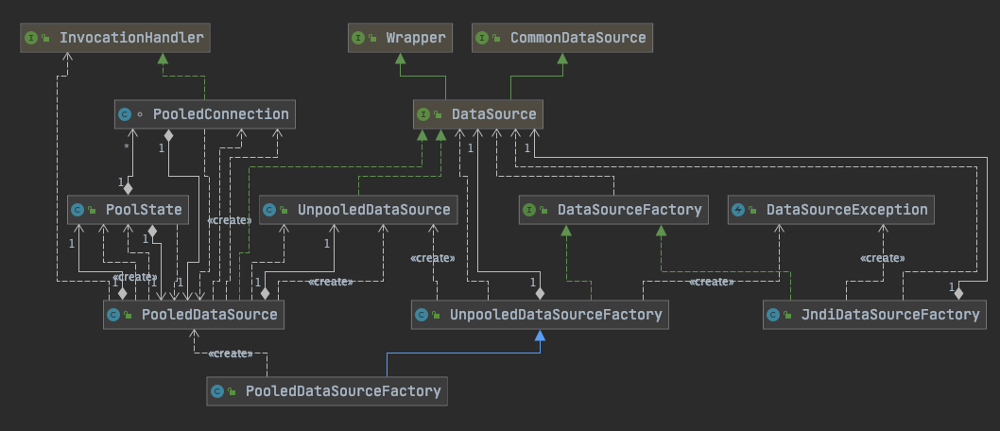
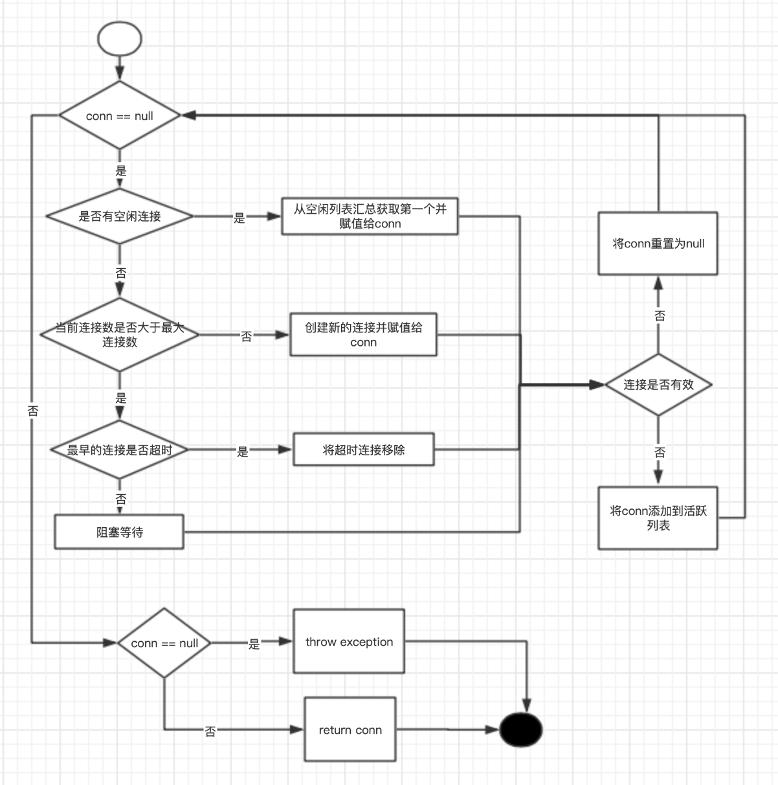
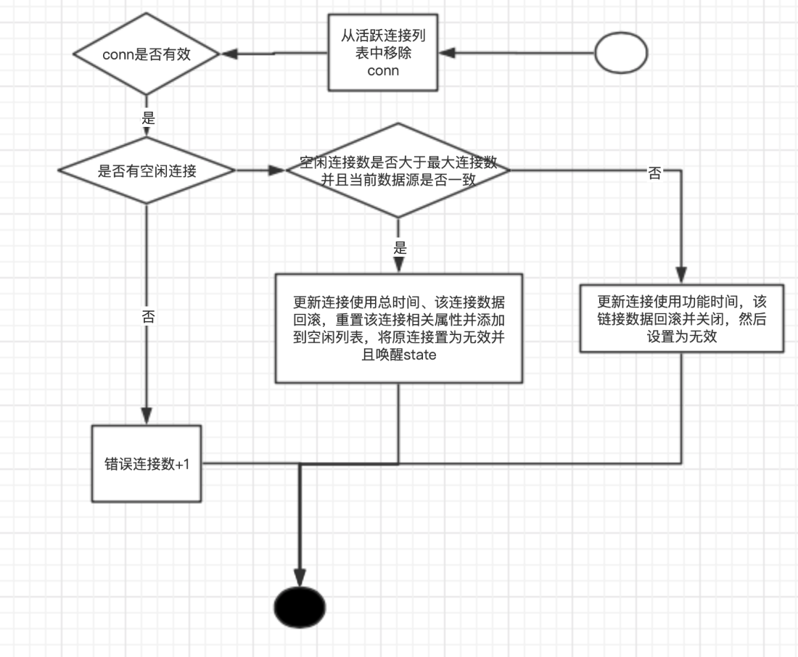

------


## **MyBatis源码解析之基础模块—DataSource**


前文回顾

上一章节我们一起学习了Mapper接口绑定的源码逻辑。本次我们学习MyBatis的DataSource数据源模块。

接下来，我们将通过源码详细介绍DataSource的执行逻辑。


### 背景知识

因为常见的数据源都会基于javax.sql.Datasource实现。Mybatis的数据源实现也是基于实现javax.sql.Datasource来设计的，也是在介绍MyBatis数据源实现之前，咱们先了解下JDK的DataSource。

关于jdk中对DataSource在Oracle官网[DataSource介绍](https://docs.oracle.com/javase/8/docs/api/javax/sql/DataSource.html)有如下一段描述：

> A factory for connections to the physical data source that this `DataSource` object represents. An alternative to the `DriverManager` facility, a `DataSource` object is the preferred means of getting a connection. An object that implements the `DataSource` interface will typically be registered with a naming service based on the Java™ Naming and Directory (JNDI) API.
>
> The `DataSource` interface is implemented by a driver vendor. There are three types of implementations:
>
> 1. Basic implementation -- produces a standard `Connection` object
> 2. Connection pooling implementation -- produces a `Connection` object that will automatically participate in connection pooling. This implementation works with a middle-tier connection pooling manager.
> 3. Distributed transaction implementation -- produces a `Connection` object that may be used for distributed transactions and almost always participates in connection pooling. This implementation works with a middle-tier transaction manager and almost always with a connection pooling manager.
>
> A `DataSource` object has properties that can be modified when necessary. For example, if the data source is moved to a different server, the property for the server can be changed. The benefit is that because the data source's properties can be changed, any code accessing that data source does not need to be changed.
>
> A driver that is accessed via a `DataSource` object does not register itself with the `DriverManager`. Rather, a `DataSource` object is retrieved though a lookup operation and then used to create a `Connection` object. With a basic implementation, the connection obtained through a `DataSource` object is identical to a connection obtained through the `DriverManager` facility.
>
> An implementation of `DataSource` must include a public no-arg constructor.

翻译过来就是：

> 一个用于连接到此DataSource对象表示的物理数据源的工厂。作为DriverManager工具的替代方法，DataSource对象是获取连接的首选方法。通常将基于Java™命名和目录（JNDI）API向实现命名服务的对象注册实现DataSource接口的对象。
>
> DataSource接口由驱动程序供应商实现。共有三种类型的实现：
>
> 基本实现-产生一个标准的Connection对象
> 连接池实现-产生一个Connection对象，该对象将自动参与连接池。此实现与中间层连接池管理器一起使用。
> 分布式事务实现-产生一个Connection对象，该对象可用于分布式事务，并且几乎总是参与连接池。此实现与中间层事务管理器一起使用，并且几乎总是与连接池管理器一起使用。
> DataSource对象具有可以在必要时修改的属性。例如，如果将数据源移动到其他服务器，则可以更改服务器的属性。好处在于，因为可以更改数据源的属性，所以不需要更改访问该数据源的任何代码。
>
> 通过DataSource对象访问的驱动程序不会在DriverManager中注册自身。而是通过查找操作检索DataSource对象，然后将其用于创建Connection对象。通过基本实现，通过DataSource对象获得的连接与通过DriverManager工具获得的连接相同。
>
> **DataSource的实现必须包括一个公共的无参数构造函数。**

根据 DataSource的实现必须包括一个公共的无参数构造函数的描述。

这也是下面分析源码时看到的为什么池化数据源PoolDataSource与非池化数据源UnpooledDataSource都有显性定义无参构造函数的原因。

关于DataSource就简单介绍到这里，有兴趣的同学可以查阅相关资料及jdk源码等。


### 架构设计

DataSource模块所在包路径为`org.apache.ibatis.datasource`，其具体划分如下：

```java
datasource
- jndi
  - JndiDataSourceFactory
- pooled
  - PooledConnection
  - PooledDataSource
  - PooledDataSourceFactory
  - PoolState
- unpooled
  - UnpooledDataSource
  - UnpooledDataSourceFactory
- DataSourceException
- DataSourceFactory
```

对应的类架构设计图如下：



从架构图中，我们很显然发现，该架构采用经典的工厂方法设计模式（关于设计模式的介绍各位可以参阅本人的另一个设计模式专题，或者其他资料）


### 源码解读

#### DataSourceFactory

`DataSourceFactory`接口只提供两个方法：`setProperties()`设置数据源相关属性；`getDataSource()`获取数据源。

```java
/**
 * 数据源工厂接口类，只提供两个方法：
 * 1.设置相关配置属性
 * 2.获取数据源
 * 3.该接口有三个实现类：PooledDataSourceFactory,UnpooledDataSourceFactory,JndiDataSourceFactory
 */
public interface DataSourceFactory {

  //设置属性（其目的是位datasource填充配置属性）
  void setProperties(Properties props);

  //获取数据源对象
  DataSource getDataSource();

}
```

MyBatis提供三种`DataSourceFactory`的实现方式：`JndiDataSourceFactory`，`UnpooledDataSourceFactory`和`PooledDataSourceFactory`。现对其逐一介绍。

#### UnpooledDataSourceFactory

`DataSourceFactory`的`UnpooledDataSourceFactory`的实现，首先会在其构造方法中直接实例化非池化的数据源`UnpooledDataSource` ，并 通过getDataSource()方法获取该数据源。`UnpooledDataSource`数据源中相关属性的填充则通过`setProperties()`进行设置。具体细节及说明，请参阅如下源码：

```java
package org.apache.ibatis.datasource.unpooled;

import java.util.Properties;
import javax.sql.DataSource;

import org.apache.ibatis.datasource.DataSourceException;
import org.apache.ibatis.datasource.DataSourceFactory;
import org.apache.ibatis.reflection.MetaObject;
import org.apache.ibatis.reflection.SystemMetaObject;

public class UnpooledDataSourceFactory implements DataSourceFactory {

  private static final String DRIVER_PROPERTY_PREFIX = "driver.";
  private static final int DRIVER_PROPERTY_PREFIX_LENGTH = DRIVER_PROPERTY_PREFIX.length();

  protected DataSource dataSource;

  public UnpooledDataSourceFactory() {
    this.dataSource = new UnpooledDataSource();
  }

  /**
   * 从properties中获取对应的配置信息
   */
  @Override
  public void setProperties(Properties properties) {
    Properties driverProperties = new Properties();
    MetaObject metaDataSource = SystemMetaObject.forObject(dataSource);
    for (Object key : properties.keySet()) {
      String propertyName = (String) key;
      if (propertyName.startsWith(DRIVER_PROPERTY_PREFIX)) {
        //"driver."开头的为DataSource相关配置，均保存到driverProperties对象中，并最终会设置在metaDataSource中
        String value = properties.getProperty(propertyName);
        driverProperties.setProperty(propertyName.substring(DRIVER_PROPERTY_PREFIX_LENGTH), value);
      } else if (metaDataSource.hasSetter(propertyName)) {
        //普通配置属性直接设置在metaDataSource中
        String value = (String) properties.get(propertyName);
        //调用私有类型转换方法
        Object convertedValue = convertValue(metaDataSource, propertyName, value);
        metaDataSource.setValue(propertyName, convertedValue);
      } else {
        throw new DataSourceException("Unknown DataSource property: " + propertyName);
      }
    }
    /** driverProperties对象有值的情况下才设置 */
    if (driverProperties.size() > 0) {
      metaDataSource.setValue("driverProperties", driverProperties);
    }
  }

  @Override
  public DataSource getDataSource() {
    return dataSource;
  }

  /** 根据propertyName的属性类型转换对应的value值，主要处理Integer，long及boolean三种 */
  private Object convertValue(MetaObject metaDataSource, String propertyName, String value) {
    Object convertedValue = value;
    Class<?> targetType = metaDataSource.getSetterType(propertyName);
    if (targetType == Integer.class || targetType == int.class) {
      convertedValue = Integer.valueOf(value);
    } else if (targetType == Long.class || targetType == long.class) {
      convertedValue = Long.valueOf(value);
    } else if (targetType == Boolean.class || targetType == boolean.class) {
      convertedValue = Boolean.valueOf(value);
    }
    return convertedValue;
  }

}
```

#### PooledDataSourceFactory

`PooledDataSourceFactory`实现则更为简单，他并没有复写`setProperties()`，`getDataSource()`方法，而是直接继承`UnpooledDataSourceFactory`，唯一区别就是构造方法中dataSource实例化对象为`PooledDataSource`，具体代码如下

```java
public class PooledDataSourceFactory extends UnpooledDataSourceFactory {

  public PooledDataSourceFactory() {
    //与UnpooledDataSourceFactory唯一的区别
    this.dataSource = new PooledDataSource();
  }
}
```

#### JndiDataSourceFactory

介绍`JndiDataSourceFactory`之前，先简单介绍下JNDI（全称为Java Naming and Directory Interface）， JNDI是 SUN 公司提供的一种标准的 Java 命名系统接口，JNDI 提供统一的客户端 API，通过不同的访问提供者接口 JNDI 服务供应接口 ( SPI ) 的实现，由管理者将 JNDI API 映射为特定的命名服务和目录系统，使得 Java 应用程序可以和这些命名服务和目录服务之间进行交互。其根本目的还是降低耦合性，提供部署的灵活性，降低维护成本。

`JndiDataSourceFactory`实现与上述两种有所不同，从其命名的方式就可以知道DataSource的设置需要依赖具体的数据源厂商，因此不能在构造函数中进行实例化。所以只能从配置中读取相关信息，然后根据Context上下文环境，通过lookup的方式进行实例化。

具体细节及说明，请看如下代码及相关注释：

```java
package org.apache.ibatis.datasource.jndi;

import java.util.Map.Entry;
import java.util.Properties;

import javax.naming.Context;
import javax.naming.InitialContext;
import javax.naming.NamingException;
import javax.sql.DataSource;

import org.apache.ibatis.datasource.DataSourceException;
import org.apache.ibatis.datasource.DataSourceFactory;

/**
 * Jndi数据源工厂类
 */
public class JndiDataSourceFactory implements DataSourceFactory {

  public static final String INITIAL_CONTEXT = "initial_context";
  public static final String DATA_SOURCE = "data_source";
  public static final String ENV_PREFIX = "env.";

  private DataSource dataSource;

  /**
   * 根据传入的properties传入的属性，获取以"env."开头的键值对属性，并存入env 对象中
   * 如果env为null，则调用InitialContext无参构造函数
   * 如果env不为null，则根据调用InitialContext 有参构造函数将env对象传入，进行初始化。
   *
   * 若传入的properties中存在initial_context属性，且存在data_source属性，则先根据initial_context作为key通过initCtx进行查找。
   *    然后根据查找出的ctx对象继续以data_source为key进行查找，并将返回的对象转换为DataSource数据源
   * 否则 如果properties中包含data_source 的key，则直接调用initCtx获取对象并返回DataSource数据源
   * */
  @Override
  public void setProperties(Properties properties) {
    try {
      InitialContext initCtx;
      Properties env = getEnvProperties(properties);
      if (env == null) {
        initCtx = new InitialContext();
      } else {
        initCtx = new InitialContext(env);
      }

      if (properties.containsKey(INITIAL_CONTEXT)
          && properties.containsKey(DATA_SOURCE)) {
        Context ctx = (Context) initCtx.lookup(properties.getProperty(INITIAL_CONTEXT));
        dataSource = (DataSource) ctx.lookup(properties.getProperty(DATA_SOURCE));
      } else if (properties.containsKey(DATA_SOURCE)) {
        dataSource = (DataSource) initCtx.lookup(properties.getProperty(DATA_SOURCE));
      }

    } catch (NamingException e) {
      throw new DataSourceException("There was an error configuring JndiDataSourceTransactionPool. Cause: " + e, e);
    }
  }

  @Override
  public DataSource getDataSource() {
    return dataSource;
  }

  /** 根据properties中属性信息获取以"env."开头的配置信息，并将其（去除"env."的key）键值对添加到contextProperties中 */
  private static Properties getEnvProperties(Properties allProps) {
    final String PREFIX = ENV_PREFIX;
    Properties contextProperties = null;
    for (Entry<Object, Object> entry : allProps.entrySet()) {
      String key = (String) entry.getKey();
      String value = (String) entry.getValue();
      if (key.startsWith(PREFIX)) {
        if (contextProperties == null) {
          contextProperties = new Properties();
        }
        contextProperties.put(key.substring(PREFIX.length()), value);
      }
    }
    return contextProperties;
  }
}
```


介绍完DataSourceFactory的几种实现，下面咱们一起来看下DataSource的两种实现：`UnpooledDataSource` 和 `PooledDataSource`。由于`PooledDataSource`实现中会依赖`UnpooledDataSource`，所以咱们先看下`UnpooledDataSource`

#### UnpooledDataSource

首先看下`UnpooledDataSource`类的几个属性：

```java

  private ClassLoader driverClassLoader; //driver的类加载器
  private Properties driverProperties; //数据库相关的驱动配置信息
  private static Map<String, Driver> registeredDrivers = new ConcurrentHashMap<>(); //从DriverManager中已注册的驱动复制而来

  private String driver; //驱动类全路径名称
  private String url; //数据库连接地址
  private String username; //数据库用户名
  private String password; //数据库密码

  private Boolean autoCommit; //是否自动提交
  private Integer defaultTransactionIsolationLevel; //事务隔离级别
  private Integer defaultNetworkTimeout; //默认网络超时时间
```

其中 registeredDrivers，该属性的设置时通过静态代码块进行初始化，从DriverManager中已注册的驱动中复制一份。代码如下：

```java
/** 初始化注册的驱动 */
static {
  Enumeration<Driver> drivers = DriverManager.getDrivers();
  while (drivers.hasMoreElements()) {
    Driver driver = drivers.nextElement();
    registeredDrivers.put(driver.getClass().getName(), driver);
  }
}
```

然后是`UnpooledDataSource`的多个构造方法的重载，以及对`javax.sql.Datasource`接口的方法实现，还有就是对上述属性对应的getter/setter方法。内容比较简单不再描述。

这里重点要说下方法`UnpooledDataSource#doGetConnection(java.lang.String, java.lang.String)`，因为`UnpooledDataSource#getConnection()`所有重载方法最终都会调用该方法。`doGetConnection(java.lang.String, java.lang.String)`方法主要逻辑是组装用户名、密码及registeredDrivers到properties中，然后调用重载方法 `org.apache.ibatis.datasource.unpooled.UnpooledDataSource#doGetConnection(java.util.Properties)`，代码如下：

```java
private Connection doGetConnection(String username, String password) throws SQLException {
  Properties props = new Properties();
  if (driverProperties != null) {
    props.putAll(driverProperties);
  }
  if (username != null) {
    props.setProperty("user", username);
  }
  if (password != null) {
    props.setProperty("password", password);
  }
  return doGetConnection(props);
}
```

通过doGetConnection重载方法最终获取数据库连接，如下：

```java
private Connection doGetConnection(Properties properties) throws SQLException {
    //初始化驱动
    initializeDriver();
    //根据数据库地址及相关属性获取connection
    Connection connection = DriverManager.getConnection(url, properties);
    //设置connection其他属性值，比如网络超时时间、是否自动提交、事务隔离级别等
    configureConnection(connection);
    //返回connection对象
    return connection;
  }

  /**
   * 初始化驱动：
   * 1、首先判断registeredDrivers是否已存在UnpooledDataSource定义的driver属性
   * 2、如果不存在
   *    2.1、如果driverClassLoader 不为空，则通过驱动类加载器获取驱动类型；否则通过Resources.classForName获取
   *    2.2、根据驱动类类型创建对应的driver实例，并将该driver实例的代理对象添加到DriverManager以及registeredDrivers中
   * 否则抛出驱动类初始化异常
   */
  private synchronized void initializeDriver() throws SQLException {
    System.out.println("**************** driver："+driver);
    if (!registeredDrivers.containsKey(driver)) {
      Class<?> driverType;
      try {
        if (driverClassLoader != null) {
          driverType = Class.forName(driver, true, driverClassLoader);
        } else {
          driverType = Resources.classForName(driver);
        }
        // DriverManager requires the driver to be loaded via the system ClassLoader.
        // http://www.kfu.com/~nsayer/Java/dyn-jdbc.html
        Driver driverInstance = (Driver)driverType.getDeclaredConstructor().newInstance();
        DriverManager.registerDriver(new DriverProxy(driverInstance));
        registeredDrivers.put(driver, driverInstance);
      } catch (Exception e) {
        throw new SQLException("Error setting driver on UnpooledDataSource. Cause: " + e);
      }
    }
  }

  /** 设置connection其他属性值，比如网络超时时间、是否自动提交、事务隔离级别等 */
  private void configureConnection(Connection conn) throws SQLException {
    if (defaultNetworkTimeout != null) {
      conn.setNetworkTimeout(Executors.newSingleThreadExecutor(), defaultNetworkTimeout);
    }
    if (autoCommit != null && autoCommit != conn.getAutoCommit()) {
      conn.setAutoCommit(autoCommit);
    }
    if (defaultTransactionIsolationLevel != null) {
      conn.setTransactionIsolation(defaultTransactionIsolationLevel);
    }
  }
```

至此，关于 `UnpooledDataSource`核心内容的介绍已完成。

但是，我们在实际的开发实践中，并不会采用非池化的数据源。我相信熟悉JDBC编程的小伙伴应该知道，数据库连接的创建过程是比较耗时的，有可能数据库的连接创建耗时比真正的数据库执行还要长。而且数据库的链接数资源就像内存一样，既宝贵又有限。为了减少这种资源浪费，聪明的程序员提出连接池这种方案。这样就避免了大量的连接池创建耗时，是的连接可以重用。理想很丰满，现实很骨感。虽然这种方案解决了连接的创建问题，但是到底多大的连接数合适呢， 经过大量的应用实践，mybatis给出了比较好的方案，根据应用的业务量通过动态配置的方式来解决该问题。下面我们继续学习下PooledDataSource相关内容。

介绍PooledDataSource之前，我们回顾下上面的架构图。从架构图中我们可以看出，PooledDataSource并不会直接维护`javax.sql.Connection`，而是通过PooledConnection来间接管理。

#### PooledConnection

`PooledConnection` 类实现了 `InvocationHandler` 接口，显然也是采用了JDK动态代理的模式。该类有三块核心点：拥有的相关属性、构造方法、及实现的invoker方法。具体说明及业务逻辑如下：

```java
class PooledConnection implements InvocationHandler {

  private static final String CLOSE = "close"; //调用的是否为close关闭连接对象方法
  private static final Class<?>[] IFACES = new Class<?>[] { Connection.class };

  private final int hashCode; //连接的hash码
  private final PooledDataSource dataSource; //连接对象所属的池化数据源
  private final Connection realConnection; //真正的连接对象
  private final Connection proxyConnection; //代理连接对象
  private long checkoutTimestamp; //连接对象检出的时间戳
  private long createdTimestamp; //连接对象创建时间戳
  private long lastUsedTimestamp; //连接对象最后一次使用的时间戳
  private int connectionTypeCode; //基于数据库URL、用户名、密码生成的连接类型code
  private boolean valid; //连接对象是否有效
  
  /**
   * 根据传入连接池数据源和连接对象 设计的简单连接对象构造方法(在连接对象被回收或激活调用时使用)
   */
  public PooledConnection(Connection connection, PooledDataSource dataSource) {
    this.hashCode = connection.hashCode();
    this.realConnection = connection;
    this.dataSource = dataSource;
    this.createdTimestamp = System.currentTimeMillis();
    this.lastUsedTimestamp = System.currentTimeMillis();
    this.valid = true;
    this.proxyConnection = (Connection) Proxy.newProxyInstance(Connection.class.getClassLoader(), IFACES, this);
  }
  
  @Override
  public Object invoke(Object proxy, Method method, Object[] args) throws Throwable {
    String methodName = method.getName();
    // 判断方法是否为close，是则将调用pushConnection方法将该连接返回到空闲列表
    if (CLOSE.equals(methodName)) {
      dataSource.pushConnection(this);
      return null;
    }
    try {
      if (!Object.class.equals(method.getDeclaringClass())) {
        // issue #579 toString() should never fail
        // throw an SQLException instead of a Runtime
        // 检查连接对象是否有效
        checkConnection();
      }
      // 调用真正的连接并返回
      return method.invoke(realConnection, args);
    } catch (Throwable t) {
      throw ExceptionUtil.unwrapThrowable(t);
    }
  }
}
```

#### PoolState

在`PooledDataSource`类中，还有个组件是PoolState，该对象主要管理连接对象相关的状态信息，比如空闲列表、活跃连接、超时时间等，详细见代码：

```java
public class PoolState {

  protected PooledDataSource dataSource; //连接池数据源(通过构造方法设置)

  protected final List<PooledConnection> idleConnections = new ArrayList<>(); //空闲连接对象列表
  protected final List<PooledConnection> activeConnections = new ArrayList<>(); //激活使用中的连接对象列表
  protected long requestCount = 0; //请求数
  protected long accumulatedRequestTime = 0; //累计连接时间
  protected long accumulatedCheckoutTime = 0; //累计检出时间
  protected long claimedOverdueConnectionCount = 0; //超时的连接个数
  protected long accumulatedCheckoutTimeOfOverdueConnections = 0; //累计超时时间
  protected long accumulatedWaitTime = 0; //累计等待时间
  protected long hadToWaitCount = 0; //等待次数
  protected long badConnectionCount = 0; //无效的连接数

  public PoolState(PooledDataSource dataSource) {
    this.dataSource = dataSource;
  }
}
```

PoolState中个属性值会在不断调用、回收、及检测中更新值。

#### PooledDataSource

终于可以讲解PooledDataSource了， 这是DataSource章节中的重中之重。PooledDataSource代码较多，我们只需要关注几个核心内容:

PooledDataSource 相关属性对象：

```java

  private final PoolState state = new PoolState(this); //数据源状态维护

  private final UnpooledDataSource dataSource; //通过UnpooledDataSource获取真正的连接，该对象在构造方法中进行实例化

  // OPTIONAL CONFIGURATION FIELDS
  protected int poolMaximumActiveConnections = 10;//最大活跃数
  protected int poolMaximumIdleConnections = 5; //最大空闲连接数
  protected int poolMaximumCheckoutTime = 20000; //最大检出时间
  protected int poolTimeToWait = 20000; //连接阻塞需要等待的时间
  protected int poolMaximumLocalBadConnectionTolerance = 3; //可容忍的连接池最大无效连接数
  protected String poolPingQuery = "NO PING QUERY SET"; //ping 语句
  protected boolean poolPingEnabled; //是否允许发送检查sql语句
  protected int poolPingConnectionsNotUsedFor; //连接超时的阈值，超过该阈值会发送一次连接测试sql，检查连接是否可用

  private int expectedConnectionTypeCode; //期望数据源连接码：url+username+password 进行hash计算获取

```

forceCloseAll()，该方法关闭所有的空闲连接对象、激活连接对象。该方法会在设置数据源属性时调用，比如设置driver、url、username、password、autoCommint等

```java
/**
* 分别递归倒序循环激活连接列表，空闲连接列表。
* 将连接对象从对应列表移除，并将连接对象设置为无效。同时判断该真正连接是否设置自动提交，若不是则进行rollback回滚。
*/
public void forceCloseAll() {
  synchronized (state) {
    expectedConnectionTypeCode = assembleConnectionTypeCode(dataSource.getUrl(), dataSource.getUsername(), dataSource.getPassword());
    for (int i = state.activeConnections.size(); i > 0; i--) {
      try {
        PooledConnection conn = state.activeConnections.remove(i - 1);
        conn.invalidate();

        Connection realConn = conn.getRealConnection();
        if (!realConn.getAutoCommit()) {
          realConn.rollback();
        }
        realConn.close();
      } catch (Exception e) {
        // ignore
      }
    }
    for (int i = state.idleConnections.size(); i > 0; i--) {
      try {
        PooledConnection conn = state.idleConnections.remove(i - 1);
        conn.invalidate();

        Connection realConn = conn.getRealConnection();
        if (!realConn.getAutoCommit()) {
          realConn.rollback();
        }
        realConn.close();
      } catch (Exception e) {
        // ignore
      }
    }
  }
  if (log.isDebugEnabled()) {
    log.debug("PooledDataSource forcefully closed/removed all connections.");
  }
}
```

PooledDataSource#getConnection()获取连接对象并不是每次都会新创建新的连接，而是看空闲列表中是否存在空闲连接，有就直接获取一个。具体是通过调用popConnection方法获取连接对象。因为此处逻辑比较复杂，先看下逻辑图，然后再分析源码。



上图为popConnection获取连接对象的主要流程图，当然，一些state相关的参数设置忽略了，详情看如下代码：

```javascript
/** 从连接池获取连接对象 */
private PooledConnection popConnection(String username, String password) throws SQLException {
  boolean countedWait = false;
  PooledConnection conn = null;
  long t = System.currentTimeMillis();
  int localBadConnectionCount = 0;

  while (conn == null) {
    synchronized (state) {
      if (!state.idleConnections.isEmpty()) {
        // Pool has available connection
        conn = state.idleConnections.remove(0);
        if (log.isDebugEnabled()) {
          log.debug("Checked out connection " + conn.getRealHashCode() + " from pool.");
        }
      } else {
        // Pool does not have available connection
        if (state.activeConnections.size() < poolMaximumActiveConnections) {
          // Can create new connection
          conn = new PooledConnection(dataSource.getConnection(), this);
          if (log.isDebugEnabled()) {
            log.debug("Created connection " + conn.getRealHashCode() + ".");
          }
        } else {
          // Cannot create new connection
          // 获取最早的一个活跃连接数
          PooledConnection oldestActiveConnection = state.activeConnections.get(0);
          long longestCheckoutTime = oldestActiveConnection.getCheckoutTime();
          if (longestCheckoutTime > poolMaximumCheckoutTime) {
            // Can claim overdue connection
            state.claimedOverdueConnectionCount++;
            state.accumulatedCheckoutTimeOfOverdueConnections += longestCheckoutTime;
            state.accumulatedCheckoutTime += longestCheckoutTime;
            state.activeConnections.remove(oldestActiveConnection);
            if (!oldestActiveConnection.getRealConnection().getAutoCommit()) {
              try {
                oldestActiveConnection.getRealConnection().rollback();
              } catch (SQLException e) {
                /*
                   Just log a message for debug and continue to execute the following
                   statement like nothing happened.
                   Wrap the bad connection with a new PooledConnection, this will help
                   to not interrupt current executing thread and give current thread a
                   chance to join the next competition for another valid/good database
                   connection. At the end of this loop, bad {@link @conn} will be set as null.
                 */
                log.debug("Bad connection. Could not roll back");
              }
            }
            //重置最早连接对象的相关信息，并设置相关属性
            conn = new PooledConnection(oldestActiveConnection.getRealConnection(), this);
            conn.setCreatedTimestamp(oldestActiveConnection.getCreatedTimestamp());
            conn.setLastUsedTimestamp(oldestActiveConnection.getLastUsedTimestamp());
            oldestActiveConnection.invalidate();
            if (log.isDebugEnabled()) {
              log.debug("Claimed overdue connection " + conn.getRealHashCode() + ".");
            }
          } else {
            // Must wait
            try {
              if (!countedWait) {
                state.hadToWaitCount++;
                countedWait = true;
              }
              if (log.isDebugEnabled()) {
                log.debug("Waiting as long as " + poolTimeToWait + " milliseconds for connection.");
              }
              long wt = System.currentTimeMillis();
              //设置组着等待，等待时长为poolTimeToWait
              state.wait(poolTimeToWait);
              // 设置总的等待时间
              state.accumulatedWaitTime += System.currentTimeMillis() - wt;
            } catch (InterruptedException e) {
              break;
            }
          }
        }
      }
      if (conn != null) {
        // ping to server and check the connection is valid or not
        // 通过ping验证连接的有效性，若有效则将该连接对象添加到活跃列表中，并将连接请求数+1，加总连接请求时间等。
        if (conn.isValid()) {
          if (!conn.getRealConnection().getAutoCommit()) {
            conn.getRealConnection().rollback();
          }
          conn.setConnectionTypeCode(assembleConnectionTypeCode(dataSource.getUrl(), username, password));
          conn.setCheckoutTimestamp(System.currentTimeMillis());
          conn.setLastUsedTimestamp(System.currentTimeMillis());
          state.activeConnections.add(conn);
          state.requestCount++;
          state.accumulatedRequestTime += System.currentTimeMillis() - t;
        } else {
          if (log.isDebugEnabled()) {
            log.debug("A bad connection (" + conn.getRealHashCode() + ") was returned from the pool, getting another connection.");
          }
          //无效连接数+1
          state.badConnectionCount++;
          localBadConnectionCount++;
          conn = null;
          if (localBadConnectionCount > (poolMaximumIdleConnections + poolMaximumLocalBadConnectionTolerance)) {
            if (log.isDebugEnabled()) {
              log.debug("PooledDataSource: Could not get a good connection to the database.");
            }
            throw new SQLException("PooledDataSource: Could not get a good connection to the database.");
          }
        }
      }
    }

  }
```

介绍完获取连接对象，下面咱们看下PooledDataSource如何回收连接的。咱们也同样先看下业务逻辑图：



具体逻辑及源码分析见代码：

```java
protected void pushConnection(PooledConnection conn) throws SQLException {
  synchronized (state) {
    // 从活跃列表删除
    state.activeConnections.remove(conn);
    // 判断连接有效性
    if (conn.isValid()) {
      // 判断空闲列表是否小于最大值并且是否为同一个数据源
      if (state.idleConnections.size() < poolMaximumIdleConnections && conn.getConnectionTypeCode() == expectedConnectionTypeCode) {
        // 加总连接获取时间
        state.accumulatedCheckoutTime += conn.getCheckoutTime();
        // 若非自动提交，则回滚
        if (!conn.getRealConnection().getAutoCommit()) {
          conn.getRealConnection().rollback();
        }
        // 充值真实连接的相关属性，并添加到空闲列表中
        PooledConnection newConn = new PooledConnection(conn.getRealConnection(), this);
        state.idleConnections.add(newConn);
        newConn.setCreatedTimestamp(conn.getCreatedTimestamp());
        newConn.setLastUsedTimestamp(conn.getLastUsedTimestamp());
        // 当前连接置为无效
        conn.invalidate();
        if (log.isDebugEnabled()) {
          log.debug("Returned connection " + newConn.getRealHashCode() + " to pool.");
        }
        // 唤醒所有加锁等待
        state.notifyAll();
      } else {
        // 加总连接获取时间
        state.accumulatedCheckoutTime += conn.getCheckoutTime();
        // 若非自动提交，则回滚
        if (!conn.getRealConnection().getAutoCommit()) {
          conn.getRealConnection().rollback();
        }
        // 关闭真正的连接
        conn.getRealConnection().close();
        if (log.isDebugEnabled()) {
          log.debug("Closed connection " + conn.getRealHashCode() + ".");
        }
        // 将连接置为无效
        conn.invalidate();
      }
    } else {
      if (log.isDebugEnabled()) {
        log.debug("A bad connection (" + conn.getRealHashCode() + ") attempted to return to the pool, discarding connection.");
      }
      state.badConnectionCount++;
    }
  }
}
```

在popConnection、pushConnection中都会调用`conn.isValid()`判断连接是否有效，我们先看代码逻辑：

```java
public boolean isValid() {
  //只有在valid为true，真实连接不为null且dataSource能够ping检测通过的条件下才会true
  return valid && realConnection != null && dataSource.pingConnection(this);
}
//尝试ping进行验证conn的可用性
protected boolean pingConnection(PooledConnection conn) {
    boolean result = true;

    try {
      result = !conn.getRealConnection().isClosed();
    } catch (SQLException e) {
      if (log.isDebugEnabled()) {
        log.debug("Connection " + conn.getRealHashCode() + " is BAD: " + e.getMessage());
      }
      result = false;
    }

    if (result) {
      if (poolPingEnabled) {
        if (poolPingConnectionsNotUsedFor >= 0 && conn.getTimeElapsedSinceLastUse() > poolPingConnectionsNotUsedFor) {
          try {
            if (log.isDebugEnabled()) {
              log.debug("Testing connection " + conn.getRealHashCode() + " ...");
            }
            Connection realConn = conn.getRealConnection();
            try (Statement statement = realConn.createStatement()) {
              statement.executeQuery(poolPingQuery).close();
            }
            if (!realConn.getAutoCommit()) {
              realConn.rollback();
            }
            result = true;
            if (log.isDebugEnabled()) {
              log.debug("Connection " + conn.getRealHashCode() + " is GOOD!");
            }
          } catch (Exception e) {
            log.warn("Execution of ping query '" + poolPingQuery + "' failed: " + e.getMessage());
            try {
              conn.getRealConnection().close();
            } catch (Exception e2) {
              //ignore
            }
            result = false;
            if (log.isDebugEnabled()) {
              log.debug("Connection " + conn.getRealHashCode() + " is BAD: " + e.getMessage());
            }
          }
        }
      }
    }
    return result;
  }
```

至此，DataSource模块相关的核心要点均已介绍完毕。

### **总结**

DataSource模块也是采用了工厂方法、JDK动态代理等设计模式。

关于MyBatis的DataSource模块介绍至此告一段落。感谢垂阅，如有不妥之处请多多指教~


------

微观世界，达观人生。

做一名踏实的coder ！


**欢迎扫描下方二维码，关注我的个人微信公众号 ~**


