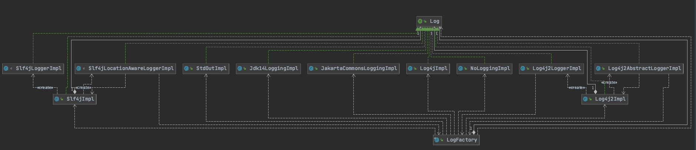

------


## **MyBatis源码解析之基础模块—Log**


前文回顾

上一章节我们一起学习了DataSource源码逻辑。本次我们学习MyBatis的Log日志处理模块。

### 背景描述

只要做过技术开发的小伙伴都应该明白日志的重要性。这是用于追踪线上运行情况及排查问题的利器。如果没有有效规范的日志输出，碰到问题特别是线上问题将会陷入一片迷茫，而且线上环境又不能随意调整。而日志中很重要的一部分还是与数据变更相关的日志。从目前国内的java开发来看，采用mybatis作为持久层框架占比更大，所以对mybatis如何处理日志，以及其处理的深层机制我们更应该一探究竟，了解其运行原理。

接下来，我们将通过源码详细介绍Log的执行逻辑。

### 架构设计

Log模块所在包路径为`org.apache.ibatis.logging`，其具体划分如下：

```java
logging
- commons
		JakartaCommonsLoggingImpl
- jdbc
    BaseJdbcLogger
    ConnectionLogger
    PreparedStatementLogger
		ResultSetLogger
		StatementLogger
- jdk14
  	Jdk14LoggingImpl
- log4j
  	Log4jImpl
- log4j2
    Log4j2AbstractLoggerImpl
    Log4j2Impl
    Log4j2LoggerImpl
- nologging
  	NoLoggingImpl
- slf4j
  	Slf4jImpl
    Slf4jLocationAwareLoggerImpl
    Slf4jLoggerImpl	
- stdout
	  StdOutImpl
- Log
- LogException
- LogFactory
```

对应的类架构设计图如下：



从架构图中各实现类可以看出，mybatis支持目前各主流的日志组件。

### 源码解读

#### Log接口

该接口提供了两个boolean类型的属性及五个日志级别的方法。内容很简单，源码如下：

```java
public interface Log {
  //是否启用debug
  boolean isDebugEnabled();
  //是否启用trace
  boolean isTraceEnabled();
  //错误日志级别输出方法
  void error(String s, Throwable e);
  //重载错误日志级别输出方法
  void error(String s);
  //debug日志级别输出方法
  void debug(String s);
  //trace日志级别输出方法
  void trace(String s);
  //warn日志级别输出方法
  void warn(String s);
}
```

简单吧。 而对Log的各实现类。都是采用`implements Log` 并 引用相应接口或类的方式来实现的，只是不同的实现类细节不同而已。接下来分别介绍不同实现类的实现细节：

#### JakartaCommonsLoggingImpl

该类引组合了common-loggingj.jar 中的Log类，在不同级别的日志输出时，会调用Log对应的日志输出方法。

#### Jdk14LoggingImpl

Jdk14LoggingImpl实现与Log4jImpl类似，调用时传入对应的日志级别及日志信息。不过其引用的Logger为java.util.logging.Logger。

#### StdOutImpl

该实现是通过标准输出到控制台的方式将日志信息打印出来，没有什么复杂逻辑：

```java
public class StdOutImpl implements Log {
  public StdOutImpl(String clazz) {
    // Do Nothing
  }
  @Override
  public boolean isDebugEnabled() {
    return true;
  }
  @Override
  public boolean isTraceEnabled() {
    return true;
  }
  @Override
  public void error(String s, Throwable e) {
    System.err.println(s);
    e.printStackTrace(System.err);
  }
  @Override
  public void error(String s) {
    System.err.println(s);
  }
  @Override
  public void debug(String s) {
    System.out.println(s);
  }
  @Override
  public void trace(String s) {
    System.out.println(s);
  }
  @Override
  public void warn(String s) {
    System.out.println(s);
  }
}
```

#### NoLoggingImpl

该接口不输出任何日志，为空实现。

#### Log4jImpl

该类引组合了apache Log4j.jar 中的Logger类，在不同级别的日志输出时，会传入对应的日志级别，及Log4jImpl的全路径类名。

```java
public class Log4jImpl implements Log {
  private static final String FQCN = Log4jImpl.class.getName();
  private final Logger log;
  public Log4jImpl(String clazz) {
    log = Logger.getLogger(clazz);
  }
  @Override
  public boolean isDebugEnabled() {
    return log.isDebugEnabled();
  }
  @Override
  public boolean isTraceEnabled() {
    return log.isTraceEnabled();
  }
  @Override
  public void error(String s, Throwable e) {
    log.log(FQCN, Level.ERROR, s, e);
  }
  @Override
  public void error(String s) {
    log.log(FQCN, Level.ERROR, s, null);
  }
  @Override
  public void debug(String s) {
    log.log(FQCN, Level.DEBUG, s, null);
  }
  @Override
  public void trace(String s) {
    log.log(FQCN, Level.TRACE, s, null);
  }
  @Override
  public void warn(String s) {
    log.log(FQCN, Level.WARN, s, null);
  }
}
```

#### Log4j2Impl

Log4j2Impl 输出方法就是调用对应Log的方法，但与众不同之处就是其构造函数：

```java
/**
   * 根据传入的全限定类名获取log4j-api.jar 下对应的Logger对象：
   * 若该对象为AbstractLogger的实例，则log的实例化为Log4j2AbstractLoggerImpl（Mybatis中Log接口的一种实现，该类会从LogFactory中获取Mybatis标识，在实例化时传入logger对象。日志输出时，需要传入全路径类名，日志界别，marker标识，messeage信息等）
   * 否则 log的实例化对象为Log4j2LoggerImpl（该类的构造函数需要传入log4j-api中Logger类型参数，并在输入日志时传入Maker标识）
   * @param clazz
   */
   public Log4j2Impl(String clazz) {
    Logger logger = LogManager.getLogger(clazz);

    if (logger instanceof AbstractLogger) {
      log = new Log4j2AbstractLoggerImpl((AbstractLogger) logger);
    } else {
      log = new Log4j2LoggerImpl(logger);
    }
  }
```

####  Slf4jImpl

Slf4jImpl 处理逻辑跟Log4j2Impl基本一致，实现方式也基本相同，此处不再赘述。

```java
public Slf4jImpl(String clazz) {
    Logger logger = LoggerFactory.getLogger(clazz);

    if (logger instanceof LocationAwareLogger) {
      try {
        // check for slf4j >= 1.6 method signature
        logger.getClass().getMethod("log", Marker.class, String.class, int.class, String.class, Object[].class, Throwable.class);
        log = new Slf4jLocationAwareLoggerImpl((LocationAwareLogger) logger);
        return;
      } catch (SecurityException | NoSuchMethodException e) {
        // fail-back to Slf4jLoggerImpl
      }
    }

    // Logger is not LocationAwareLogger or slf4j version < 1.6
    log = new Slf4jLoggerImpl(logger);
  }
```

至此，Mybatis下针对不同日志组件的处理逻辑就结束了。那针对这么多的日志开源组件，mybatis到底怎么选择的呢？咱们继续往下看。

#### 日志组件加载机制

```java
public final class LogFactory {

  /**
   * Marker to be used by logging implementations that support markers.
   */
  public static final String MARKER = "MYBATIS";

  private static Constructor<? extends Log> logConstructor;

  /**
   * 类加载时执行尝试设置使用的日志组件：
   * 依次执行直到找到一个可用的，默认第一个调用的为slf4j
   * 备注：第一个设置成功后，logConstructor 设置对应的值（每次判断该值是否为空来标识是否继续尝试）
   * 注意注意：这是在默认加载时使用的方式，而对于用户自定一个则直接调用setImplementation（这样就绕过了系统默认的）
   */
  static {
    tryImplementation(LogFactory::useSlf4jLogging);
    tryImplementation(LogFactory::useCommonsLogging);
    tryImplementation(LogFactory::useLog4J2Logging);
    tryImplementation(LogFactory::useLog4JLogging);
    tryImplementation(LogFactory::useJdkLogging);
    tryImplementation(LogFactory::useNoLogging);
  }

  private LogFactory() {
    // disable construction
  }

  public static Log getLog(Class<?> aClass) {
    return getLog(aClass.getName());
  }

  public static Log getLog(String logger) {
    try {
      return logConstructor.newInstance(logger);
    } catch (Throwable t) {
      throw new LogException("Error creating logger for logger " + logger + ".  Cause: " + t, t);
    }
  }

  /**
   * 用户自定义采用的日志组件，根据用户在config.xml中setting节点配置的值来决定使用哪个
   * @param clazz
   */
  public static synchronized void useCustomLogging(Class<? extends Log> clazz) {
    setImplementation(clazz);
  }
  //使用slf4j日志组件
  public static synchronized void useSlf4jLogging() {
    setImplementation(org.apache.ibatis.logging.slf4j.Slf4jImpl.class);
  }
  //使用common-logging日志组件
  public static synchronized void useCommonsLogging() {
    setImplementation(org.apache.ibatis.logging.commons.JakartaCommonsLoggingImpl.class);
  }
  //使用log4j日志组件
  public static synchronized void useLog4JLogging() {
    setImplementation(org.apache.ibatis.logging.log4j.Log4jImpl.class);
  }
  //使用slf4j2日志组件
  public static synchronized void useLog4J2Logging() {
    setImplementation(org.apache.ibatis.logging.log4j2.Log4j2Impl.class);
  }
  //使用jul下日志组件
  public static synchronized void useJdkLogging() {
    setImplementation(org.apache.ibatis.logging.jdk14.Jdk14LoggingImpl.class);
  }
  //使用控制台标准输出
  public static synchronized void useStdOutLogging() {
    setImplementation(org.apache.ibatis.logging.stdout.StdOutImpl.class);
  }
  //不使用日志组件
  public static synchronized void useNoLogging() {
    setImplementation(org.apache.ibatis.logging.nologging.NoLoggingImpl.class);
  }
  //尝试启用日志组件方法
  private static void tryImplementation(Runnable runnable) {
    if (logConstructor == null) {
      try {
        runnable.run();
      } catch (Throwable t) {
        // ignore
      }
    }
  }

  /**
   * 根据传入的实现类，获取对应的构造函数candidate，并根据candidate获取log实例，如果正常执行完，则将candidate赋值给logConstructor
   * @param implClass
   */
  private static void setImplementation(Class<? extends Log> implClass) {
    try {
      Constructor<? extends Log> candidate = implClass.getConstructor(String.class);
      Log log = candidate.newInstance(LogFactory.class.getName());
      if (log.isDebugEnabled()) {
        log.debug("Logging initialized using '" + implClass + "' adapter.");
      }
      logConstructor = candidate;
    } catch (Throwable t) {
      throw new LogException("Error setting Log implementation.  Cause: " + t, t);
    }
  }
}
```

1. 首先在类加载时，会执行所有的默认开源日志组件，直到找到一个。
2. 同时提供useCustomLogging方法，并根据config.xml中的setting配置使用对应的日志组件。

具体的说明请参看源码中注释。

#### Configuration

在Configuration类实例化的无参构造函数中，会通过typeAliasRegistry属性注册所有的日志实现类。

```
public Configuration() {
    //注册日志组件
    typeAliasRegistry.registerAlias("SLF4J", Slf4jImpl.class);
    typeAliasRegistry.registerAlias("COMMONS_LOGGING", JakartaCommonsLoggingImpl.class);
    typeAliasRegistry.registerAlias("LOG4J", Log4jImpl.class);
    typeAliasRegistry.registerAlias("LOG4J2", Log4j2Impl.class);
    typeAliasRegistry.registerAlias("JDK_LOGGING", Jdk14LoggingImpl.class);
    typeAliasRegistry.registerAlias("STDOUT_LOGGING", StdOutImpl.class);
    typeAliasRegistry.registerAlias("NO_LOGGING", NoLoggingImpl.class);
  }
```

这段registerAlias代码是<setting name="logImpl" value="LOG4J"/> 配置生效的基础。

### 如何配置指定日志组件

在传统通过Configuration.xml配置文件配置日志的代码如下：

```xml
<configuration>
  <settings>
    ...
    <setting name="logImpl" value="LOG4J"/>
    ...
  </settings>
</configuration>
```

`logImpl`作为typeAlias的key，咱们先埋个伏笔。

我们知道经典的mybatis配置加载采用了下面两行代码：

```java
InputStream is = Resources.getResourceAsStream("mybatis-config.xml");
SqlSessionFactory sessionFactory = new SqlSessionFactoryBuilder().build(is);
```

第一行是将配置文件转成输入流，没有深入研究的必要。

我们主要跟踪下第二行。

通过 org.apache.ibatis.session.SqlSessionFactoryBuilder#build(java.io.InputStream)方法，执行了相关解析操作。

SqlSessionFactoryBuilder核心代码：

```java
public class SqlSessionFactoryBuilder extends BaseBuilder {
  //SqlSessionFactory 组建方法
	public SqlSessionFactory build(InputStream inputStream) {
    return build(inputStream, null, null);
  }
  
  public SqlSessionFactory build(InputStream inputStream, String environment, Properties properties) {
    try {
      //此处实例化XMLConfigBuilder，同时在XMLConfigBuilder中，创建 Configuration 实例对象，并在Configuration实例化时，注册各种注册器
      XMLConfigBuilder parser = new XMLConfigBuilder(inputStream, environment, properties);
      return build(parser.parse());
    } catch (Exception e) {
      throw ExceptionFactory.wrapException("Error building SqlSession.", e);
    } finally {
      ErrorContext.instance().reset();
      try {
        // 2020/3/13 框架帮我们关闭了读取流，所以使用者无需关心
        inputStream.close();
      } catch (IOException e) {
        // Intentionally ignore. Prefer previous error.
      }
    }
  }
  //配置文件的解析
  public Configuration parse() {
    if (parsed) {
      throw new BuilderException("Each XMLConfigBuilder can only be used once.");
    }
    parsed = true;
    parseConfiguration(parser.evalNode("/configuration"));
    return configuration;
  }
  
  /**
   * 解析mybatis-config.xml配置文件中所有信息，采用模板方法的设计模式
   */
  private void parseConfiguration(XNode root) {
    try {
      //在解析config文件时，会设置对应的日志配置
      loadCustomLogImpl(settings);
    } catch (Exception e) {
      throw new BuilderException("Error parsing SQL Mapper Configuration. Cause: " + e, e);
    }
  }
  
  //载入日志配置
  private void loadCustomLogImpl(Properties props) {
    //从这里可以看到为什么Configuration中日志的key为什么设置为【logImpl】
    //logImpl配置的value值可以为：SLF4J、LOG4J、LOG4J2、JDK_LOGGING、COMMONS_LOGGING、STDOUT_LOGGING、NO_LOGGING 
    //获取对应的类路径（具体参看resolveClass源码）
    Class<? extends Log> logImpl = resolveClass(props.getProperty("logImpl"));
    //通过configuration设置使用的日志组件
    configuration.setLogImpl(logImpl);
  }
}
```

`props.getProperty("logImpl")`此处解答了上面configuration中埋下的伏笔。

> 稍微提一下MyBatis特点，在阅读源码过程中，new Xxxx() 的操作就是调用不同的构造函数 ，没有特殊的逻辑。

org.apache.ibatis.builder.xml.XMLConfigBuilder#loadCustomLogImpl方法中的resolveClass方法为XMLConfigBuilder继承的父类BaseBuilder中的方法，其源码为：

```java
public abstract class BaseBuilder {
  
	protected <T> Class<? extends T> resolveClass(String alias) {
    if (alias == null) {
      return null;
    }
    try {
      return resolveAlias(alias);
    } catch (Exception e) {
      throw new BuilderException("Error resolving class. Cause: " + e, e);
    }
  }
  
  //通过别名获取对应的类
  protected <T> Class<? extends T> resolveAlias(String alias) {
    return typeAliasRegistry.resolveAlias(alias);
  }
  
  public <T> Class<T> resolveAlias(String string) {
    try {
      if (string == null) {
        return null;
      }
      // issue #748
      String key = string.toLowerCase(Locale.ENGLISH);
      Class<T> value;
      if (typeAliases.containsKey(key)) {
        value = (Class<T>) typeAliases.get(key);
      } else {
        value = (Class<T>) Resources.classForName(string);
      }
      return value;
    } catch (ClassNotFoundException e) {
      throw new TypeException("Could not resolve type alias '" + string + "'.  Cause: " + e, e);
    }
  }
}
```

在调loadCustomLogImpl方法中调用configuration.setLogImpl(logImpl);来完成日志组件的设置。

其代码实现逻辑如下：

```java
public void setLogImpl(Class<? extends Log> logImpl) {
  //不为空时设置，否则使用默认的日志组件
  if (logImpl != null) {
    this.logImpl = logImpl;
    //最终会调用LogFactory中的useCustomLogging方法来设置日志组件
    LogFactory.useCustomLogging(this.logImpl);
  }
}
```

此处我们找到了最终的配置入口：LogFactory.useCustomLogging(this.logImpl);

我们现在分析下LogFactory源码，注意源码中的注释说明：

```java
public final class LogFactory {

  /**
   * Marker to be used by logging implementations that support markers.
   */
  public static final String MARKER = "MYBATIS";

  private static Constructor<? extends Log> logConstructor;

  /**
   * 类加载时执行尝试设置使用的日志组件：
   * 依次执行直到找到一个可用的，默认第一个调用的为slf4j
   * 备注：第一个设置成功后，logConstructor 设置对应的值（每次判断该值是否为空来标识是否继续尝试）
   * 注意注意：这是在默认加载时使用的方式，而对于用户自定一个则直接调用setImplementation（这样就绕过了系统默认的）
   */
  static {
    tryImplementation(LogFactory::useSlf4jLogging);
    tryImplementation(LogFactory::useCommonsLogging);
    tryImplementation(LogFactory::useLog4J2Logging);
    tryImplementation(LogFactory::useLog4JLogging);
    tryImplementation(LogFactory::useJdkLogging);
    tryImplementation(LogFactory::useNoLogging);
  }

  private LogFactory() {
    // disable construction
  }

  public static Log getLog(Class<?> aClass) {
    return getLog(aClass.getName());
  }

  public static Log getLog(String logger) {
    try {
      return logConstructor.newInstance(logger);
    } catch (Throwable t) {
      throw new LogException("Error creating logger for logger " + logger + ".  Cause: " + t, t);
    }
  }

  /**
   * 用户自定义采用的日志组件，根据用户在config.xml中setting节点配置的值来决定使用哪个
   * @param clazz
   */
  public static synchronized void useCustomLogging(Class<? extends Log> clazz) {
    setImplementation(clazz);
  }
  //使用slf4j日志组件
  public static synchronized void useSlf4jLogging() {
    setImplementation(org.apache.ibatis.logging.slf4j.Slf4jImpl.class);
  }
  //使用common-logging日志组件
  public static synchronized void useCommonsLogging() {
    setImplementation(org.apache.ibatis.logging.commons.JakartaCommonsLoggingImpl.class);
  }
  //使用log4j日志组件
  public static synchronized void useLog4JLogging() {
    setImplementation(org.apache.ibatis.logging.log4j.Log4jImpl.class);
  }
  //使用slf4j2日志组件
  public static synchronized void useLog4J2Logging() {
    setImplementation(org.apache.ibatis.logging.log4j2.Log4j2Impl.class);
  }
  //使用jul下日志组件
  public static synchronized void useJdkLogging() {
    setImplementation(org.apache.ibatis.logging.jdk14.Jdk14LoggingImpl.class);
  }
  //使用控制台标准输出
  public static synchronized void useStdOutLogging() {
    setImplementation(org.apache.ibatis.logging.stdout.StdOutImpl.class);
  }
  //不使用日志组件
  public static synchronized void useNoLogging() {
    setImplementation(org.apache.ibatis.logging.nologging.NoLoggingImpl.class);
  }
  //尝试启用日志组件方法
  private static void tryImplementation(Runnable runnable) {
    if (logConstructor == null) {
      try {
        runnable.run();
      } catch (Throwable t) {
        // ignore
      }
    }
  }

  /**
   * 根据传入的实现类，获取对应的构造函数candidate，并根据candidate获取log实例，如果正常执行完，则将candidate赋值给logConstructor
   * @param implClass
   */
  private static void setImplementation(Class<? extends Log> implClass) {
    try {
      Constructor<? extends Log> candidate = implClass.getConstructor(String.class);
      Log log = candidate.newInstance(LogFactory.class.getName());
      if (log.isDebugEnabled()) {
        log.debug("Logging initialized using '" + implClass + "' adapter.");
      }
      logConstructor = candidate;
    } catch (Throwable t) {
      throw new LogException("Error setting Log implementation.  Cause: " + t, t);
    }
  }
}
```

最终会看到useCustomLogging会调用setImplementation方法来设置对应的日志组件。

至此，mybatis的日志模块分析完成。

### **总结**


关于MyBatis的Log模块介绍至此告一段落。感谢垂阅，如有不妥之处请多多指教~


------

微观世界，达观人生。

做一名踏实的coder ！


**欢迎扫描下方二维码，关注我的个人微信公众号 ~**


