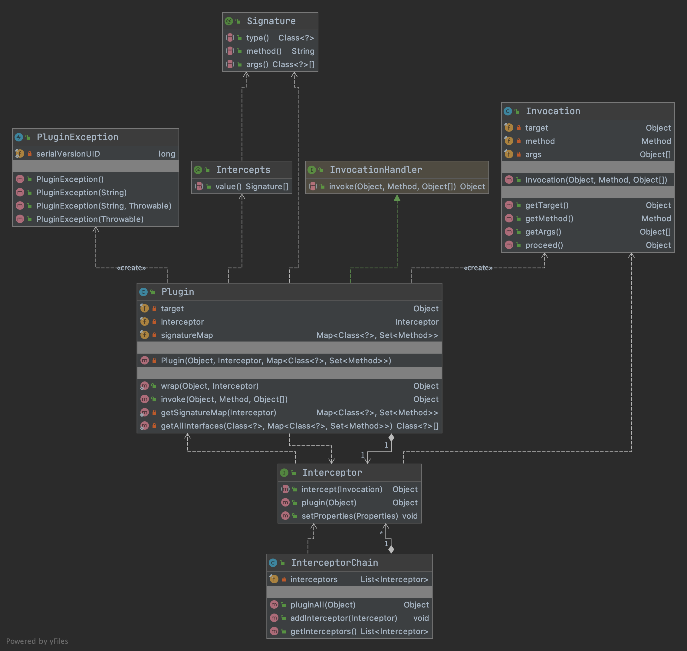

------


## **MyBatis源码解析之基础模块—Plugin**


前文回顾

上一章节我们一起学习了Mapper接口绑定的源码逻辑。本次我们学习MyBatis的Plugin数据源模块。


### 架构设计

Plugin模块所在包路径为`org.apache.ibatis.plugin`，对应的类架构设计图如下：




### 源码解读

#### Signature

Signature注解类主要定义了三个属性，通过这些属性定位对应要拦截的方法。

```java
package org.apache.ibatis.plugin;

import java.lang.annotation.Documented;
import java.lang.annotation.Retention;
import java.lang.annotation.RetentionPolicy;
import java.lang.annotation.Target;

/**
 * 拦截器方法签名注解类
 */
@Documented
@Retention(RetentionPolicy.RUNTIME)
@Target({})
public @interface Signature {
  /**
   * type为执行器类型
   */
  Class<?> type();

  /**
   * 要拦截的方法名
   */
  String method();

  /**
   * 被拦截方法的参数数组列表（切记参数列表的顺序要完全一致）
   */
  Class<?>[] args();
}

```

#### Intercepts

该注解类只有一个属性，即Signature数组列表。也即是说该注解是一个拦截组合，里面聚合了多个要拦截的方法签名。

```java
public @interface Intercepts {
  /**
   * 要拦截的方法签名数组
   */
  Signature[] value();
}
```

用于编写的自定义拦截器实现类，其注解格式如下：

```java
@Intercepts({@Signature(type= Executor.class, method = "update", args = {MappedStatement.class ,Object.class})})
```

Signature、Intercepts定义了拦截注解的标志，那mybatis是如何实现拦截的呢？咱们接着往下看。

#### Invocation

在Mybatis的plugin包中，定义了一个Invocation类，该类有三个属性：target、method、args。看到这三个大家应该似曾相识吧，没错就是与动态代理有关。

同时封装了反射调用的方法。

```java
package org.apache.ibatis.plugin;

import java.lang.reflect.InvocationTargetException;
import java.lang.reflect.Method;

public class Invocation {

  private final Object target; //目标对象
  private final Method method; //执行方法
  private final Object[] args; //方法参数

  //构造犯法
  public Invocation(Object target, Method method, Object[] args) {
    this.target = target;
    this.method = method;
    this.args = args;
  }

  /*** target、method、args的get方法 ***/

  //代理执行方法
  public Object proceed() throws InvocationTargetException, IllegalAccessException {
    //反射调用
    return method.invoke(target, args);
  }
}

```


#### Interceptor

Interceptor为自定义的拦截器接口，用户自定义的拦截器都必须实现该接口。该接口及内部方法的具体的说明参考源码注释：

```java
package org.apache.ibatis.plugin;

import java.util.Properties;

/**
 * @author Clinton Begin
 * 自定义拦截器的接口
 * 实现该接口的实现类，需要有注解：
 样例：
 @Intercepts({@Signature(type= Executor.class, method = "update", args = {MappedStatement.class 	     ,Object.class})})
 */
public interface Interceptor {

  //对需要拦截的业务进行增强操作，跟jdk动态代理类似
  Object intercept(Invocation invocation) throws Throwable;

  /**
   * @desc 作用：
   * 如果被拦截对象所在的在类有实现接口就为当前拦截对象生成一个代理对象
   * 如果被拦截对象所在的在类没有指定的接口，不需要则返回当前对象
   * @param target 参数为被拦截的对象
   * @return
   */
  default Object plugin(Object target) {
    return Plugin.wrap(target, this);
  }
  //读取配置文件中的属性信息（默认空实现，如果用户自定义了相关配置参数，则需要做相应处理）
  default void setProperties(Properties properties) {
    // NOP
  }
}
```


#### InterceptorChain

考虑到一个项目中可能存在多个拦截器实现，比如分页结果，sql语句封装、参数赋值等。所以为了方便，Mybatis提供了拦截器链类。

```java
package org.apache.ibatis.plugin;

import java.util.ArrayList;
import java.util.Collections;
import java.util.List;

/**
 * @author Clinton Begin
 */
public class InterceptorChain {

  //定义拦截器list对象
  private final List<Interceptor> interceptors = new ArrayList<>();
  //执行传入对象的所有拦截操作，并返回执行结果
  public Object pluginAll(Object target) {
    for (Interceptor interceptor : interceptors) {
      target = interceptor.plugin(target);
    }
    return target;
  }

  //将拦截器加入到拦截器列表中
  public void addInterceptor(Interceptor interceptor) {
    interceptors.add(interceptor);
  }

  //获取所有拦截器
  public List<Interceptor> getInterceptors() {
    return Collections.unmodifiableList(interceptors);
  }
}
```


基础类相关源码分析铺垫的差不多了。细心的你或许会发现：到目前为止并没有分析具体怎么执行拦截操作的。其实上述分析中，咱们并没有详细说明Interceptor中的plugin方法实现。该方法内部则是直接调用了Plugin的静态方法wrap。接下来咱们细致分析其实现逻辑。

#### Plugin

Plugin中实现了相关的具体逻辑，比如目标对象的包装（wrap），invoke方法的逻辑，签名map的组装等。具体请参看源码及注释：

```java
package org.apache.ibatis.plugin;

import java.lang.reflect.InvocationHandler;
import java.lang.reflect.Method;
import java.lang.reflect.Proxy;
import java.util.HashMap;
import java.util.HashSet;
import java.util.Map;
import java.util.Set;

import org.apache.ibatis.reflection.ExceptionUtil;

public class Plugin implements InvocationHandler {

  private final Object target; //目标对象
  private final Interceptor interceptor; //拦截器
  private final Map<Class<?>, Set<Method>> signatureMap; //签名方法map集合

  //构造函数
  private Plugin(Object target, Interceptor interceptor, Map<Class<?>, Set<Method>> signatureMap) {
    this.target = target;
    this.interceptor = interceptor;
    this.signatureMap = signatureMap;
  }

  /**
   * 包装目标对象，如果对象对应的类有拦截注解，则通过Proxy进行代理包装并返回代理对象，否则直接返回当前目标对象
   */
  public static Object wrap(Object target, Interceptor interceptor) {
    Map<Class<?>, Set<Method>> signatureMap = getSignatureMap(interceptor);
    Class<?> type = target.getClass();
    Class<?>[] interfaces = getAllInterfaces(type, signatureMap);
    if (interfaces.length > 0) {
      return Proxy.newProxyInstance(
          type.getClassLoader(),
          interfaces,
          new Plugin(target, interceptor, signatureMap));
    }
    return target;
  }

  /**
   * 实现Jdk动态代理的invoke方法
   * 如果签名注解中的method集合不为空，且传入的method在该method集合中，则进行了拦截操作，并调用对应的拦截实现类方法
   * 否则，直接invoke调用
   * @param proxy
   * @param method
   * @param args
   * @return
   * @throws Throwable
   */
  @Override
  public Object invoke(Object proxy, Method method, Object[] args) throws Throwable {
    try {
      Set<Method> methods = signatureMap.get(method.getDeclaringClass());
      if (methods != null && methods.contains(method)) {
        return interceptor.intercept(new Invocation(target, method, args));
      }
      return method.invoke(target, args);
    } catch (Exception e) {
      throw ExceptionUtil.unwrapThrowable(e);
    }
  }

  /**
   * 根据传入的拦截器获取拦截器注解
   * 如果拦截器为null，则抛出无@Intercepts 注解的异常
   * 获取拦截器中所有签名注解数组
   * 循环所有签名数组，将sig添加到signatureMap中，并构造Method的Set集合，将sig构造的method添加到methods集合中
   */
  private static Map<Class<?>, Set<Method>> getSignatureMap(Interceptor interceptor) {
    Intercepts interceptsAnnotation = interceptor.getClass().getAnnotation(Intercepts.class);
    // issue #251
    if (interceptsAnnotation == null) {
      throw new PluginException("No @Intercepts annotation was found in interceptor " + interceptor.getClass().getName());
    }
    Signature[] sigs = interceptsAnnotation.value();
    Map<Class<?>, Set<Method>> signatureMap = new HashMap<>();
    for (Signature sig : sigs) {
      Set<Method> methods = signatureMap.computeIfAbsent(sig.type(), k -> new HashSet<>());
      try {
        Method method = sig.type().getMethod(sig.method(), sig.args());
        methods.add(method);
      } catch (NoSuchMethodException e) {
        throw new PluginException("Could not find method on " + sig.type() + " named " + sig.method() + ". Cause: " + e, e);
      }
    }
    return signatureMap;
  }

  /**
   * 根据传入的参数type，获取该类的所有接口Set集合
   * 如果type不为null，且type接口在signatureMap中，则添加到set集合中
   */
  private static Class<?>[] getAllInterfaces(Class<?> type, Map<Class<?>, Set<Method>> signatureMap) {
    Set<Class<?>> interfaces = new HashSet<>();
    while (type != null) {
      for (Class<?> c : type.getInterfaces()) {
        if (signatureMap.containsKey(c)) {
          interfaces.add(c);
        }
      }
      type = type.getSuperclass();
    }
    return interfaces.toArray(new Class<?>[interfaces.size()]);
  }
}
```


以上是Mybatis的拦截的实现逻辑，那么实现逻辑怎么被调用起来呢？这就要研究Configuration中的相关代码了，继续往下看：

#### Configuration之Plugin调用

下面咱们只关注Configuration中拦截器相关的方法

```java
//实例化拦截器链属性
  protected final InterceptorChain interceptorChain = new InterceptorChain();

 // 获取拦截器拦截器链中的拦截器列表
  public List<Interceptor> getInterceptors() {
    return interceptorChain.getInterceptors();
  }
//向拦截器链中添加拦截器
  public void addInterceptor(Interceptor interceptor) {
    interceptorChain.addInterceptor(interceptor);
  }

// 创建参数处理器对象（创建过程或调用拦截器链，并对对象进行包装）
  public ParameterHandler newParameterHandler(MappedStatement mappedStatement, Object parameterObject, BoundSql boundSql) {
    ParameterHandler parameterHandler = mappedStatement.getLang().createParameterHandler(mappedStatement, parameterObject, boundSql);
    parameterHandler = (ParameterHandler) interceptorChain.pluginAll(parameterHandler);
    return parameterHandler;
  }
  // 创建结果集处理器对象（创建过程或调用拦截器链，并对对象进行包装）
  public ResultSetHandler newResultSetHandler(Executor executor, MappedStatement mappedStatement, RowBounds rowBounds, ParameterHandler parameterHandler,
      ResultHandler resultHandler, BoundSql boundSql) {
    ResultSetHandler resultSetHandler = new DefaultResultSetHandler(executor, mappedStatement, parameterHandler, resultHandler, boundSql, rowBounds);
    resultSetHandler = (ResultSetHandler) interceptorChain.pluginAll(resultSetHandler);
    return resultSetHandler;
  }

  // 创建参数处理器对象（创建过程或调用拦截器链，并对对象进行包装）
  public StatementHandler newStatementHandler(Executor executor, MappedStatement mappedStatement, Object parameterObject, RowBounds rowBounds, ResultHandler resultHandler, BoundSql boundSql) {
    StatementHandler statementHandler = new RoutingStatementHandler(executor, mappedStatement, parameterObject, rowBounds, resultHandler, boundSql);
    statementHandler = (StatementHandler) interceptorChain.pluginAll(statementHandler);
    return statementHandler;
  }

  public Executor newExecutor(Transaction transaction) {
    return newExecutor(transaction, defaultExecutorType);
  }

  //根据传入的执行器类型创建对应的执行器实例 并调用拦截器链，并对对象进行包装
  public Executor newExecutor(Transaction transaction, ExecutorType executorType) {
    executorType = executorType == null ? defaultExecutorType : executorType;
    executorType = executorType == null ? ExecutorType.SIMPLE : executorType;
    Executor executor;
    if (ExecutorType.BATCH == executorType) {
      executor = new BatchExecutor(this, transaction);
    } else if (ExecutorType.REUSE == executorType) {
      executor = new ReuseExecutor(this, transaction);
    } else {
      executor = new SimpleExecutor(this, transaction);
    }
    if (cacheEnabled) {
      executor = new CachingExecutor(executor);
    }
    executor = (Executor) interceptorChain.pluginAll(executor);
    return executor;
  }
```

其中newParameterHandler，newResultSetHandler会在StatementHandler的抽象实现类BaseStatementHandler的构造方法中调用。而newStatementhandler会在BatchExecutor、ReuseExecutor、SimpleExecutor的query、update方法中调用。最后的newExecutor则是在mybatis创建session时调用。

### 总结

上文对Mybatis拦截器的相关源码进行了解析。下面再说下mybatis拦截器的调用过程：

1、项目启动时，Mybatis会实例化Configuration，并根据相关参数进行配置。比如创建拦截器链等。

2、外部的自定义拦截器通过InterceptorChain添加到拦截器链中。

3、在执行数据库操作，创建session会话时，调用相关执行器时会对对象进行包装（可能进行拦截操作）

4、在sql的执行过程中，比如参数处理器、sql语句处理器、结果集处理器等的实例化过程中，根据是否配置拦截器进行封装（生成相关代理类），并执行用户自定义的相关拦截器实现方法。

关于MyBatis的Plugin模块介绍至此告一段落。感谢垂阅，如有不妥之处请多多指教~


------

微观世界，达观人生。

做一名踏实的coder ！


**欢迎扫描下方二维码，关注我的个人微信公众号 ~**


