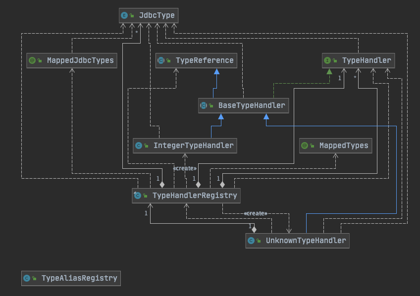

------


## **MyBatis源码解析之基础模块—TypeHandler**


### 前文回顾

上一章节我们一起分析了Mybatis的Plugin模块的源码。掌握了如何配置拦截器注解，如何自定义拦截器以及拦截器的执行过程。

在使用Mybatis的过程中，基本上我们都要在xml中编写相应的sql语句以及对应的java属性与字段的转换。那么对于数据库与java之间的转换，Mybatis是怎么做的呢？

接下来本章节我们对MyBatis Type模块类型转换的源码进行分析。

### 架构设计

按惯例，咱们先了解下Type模块的总体架构设计。

Type模块所在包路径为`org.apache.ibatis.type`，其对应的类架构设计图如下：



​	以上为Type模块的架构逻辑，当然针对不同的类型转换实现，架构图中只展示了IntegerTypeHandler、UnknownTypeHandler两个典型实现。

​	基于架构图，接下来逐个分析其实现源码。

### 源码解读

#### JdbcType

JdbcType就是一个枚举类。该类定义了常用的一些数据类型，比如Integer，Double，Date，Date等，基本上满足了我们开发中常用的数据类型。

```java
package org.apache.ibatis.type;

import java.sql.Types;
import java.util.HashMap;
import java.util.Map;

public enum JdbcType {
  INTEGER(Types.INTEGER),
  BIGINT(Types.BIGINT),
  FLOAT(Types.FLOAT),
  REAL(Types.REAL),
  DOUBLE(Types.DOUBLE),
  NUMERIC(Types.NUMERIC),
  DECIMAL(Types.DECIMAL),
  CHAR(Types.CHAR),
  VARCHAR(Types.VARCHAR),
  DATE(Types.DATE),
  BOOLEAN(Types.BOOLEAN)
    ……
    ; // JDBC 4.2 JDK8

  public final int TYPE_CODE;
  private static Map<Integer,JdbcType> codeLookup = new HashMap<>();

  static {
    for (JdbcType type : JdbcType.values()) {
      codeLookup.put(type.TYPE_CODE, type);
    }
  }

  JdbcType(int code) {
    this.TYPE_CODE = code;
  }

  public static JdbcType forCode(int code)  {
    return codeLookup.get(code);
  }
}
```


#### MappedTypes

该注解接口作用于类型转换的实现类，用于标注要映射的**java**类型。

```java
public @interface MappedTypes {
  /**
   * 返回要映射处理的java类型集合
   */
  Class<?>[] value();
}
```

#### MappedJdbcTypes

该注解接口作用于类型转换的实现类，用于标注要映射的**数据库**类型。

```java
public @interface MappedJdbcTypes {
  /**
   * 返回要映射处理的jdbc类型集合
   */
  JdbcType[] value();

  /**
   * 返回是否映射空值 默认false
   */
  boolean includeNullJdbcType() default false;
}
```

关于MappedTypes、MappedJdbcTypes的使用，可参考源码测试中的StringTrimmingTypeHandler类：

```java
@MappedTypes(String.class)
@MappedJdbcTypes(value={JdbcType.CHAR,JdbcType.VARCHAR}, includeNullJdbcType=true)
public class StringTrimmingTypeHandler implements TypeHandler<String> {
  //方法实现ain略
}
```

#### TypeReference

TypeReference的核心功能是获取类型转换实现类的父类泛型参数类型，听起来貌似有点绕😊。在转换实现类（比如IntegerTypeHandler）在实例化时，会调用TypeReference的构造函数，而该构造函数中会执行获取父类泛型参数类型的方法getSuperclassTypeParameter()。类的详细说明请参看源码注释说明：

```java
package org.apache.ibatis.type;

import java.lang.reflect.ParameterizedType;
import java.lang.reflect.Type;

public abstract class TypeReference<T> {

  //原生类型
  private final Type rawType;

  //构造函数，设置原生类型
  protected TypeReference() {
    rawType = getSuperclassTypeParameter(getClass());
  }

  /**
   * 功能描述：根据当前类的Class信息获取超类泛型的参数类型（比如IntegerHandlerType的超类泛型参数为Integer）
   * @param clazz
   * @return
   */
  Type getSuperclassTypeParameter(Class<?> clazz) {
    Type genericSuperclass = clazz.getGenericSuperclass();
    //如果传入类的泛型父类为Class的实例且不为TypeReference类，则已clazz的父类为参数递归调用getSuperclassTypeParameter；否则抛出异常
    if (genericSuperclass instanceof Class) {
      // try to climb up the hierarchy until meet something useful
      if (TypeReference.class != genericSuperclass) {
        return getSuperclassTypeParameter(clazz.getSuperclass());
      }
      throw new TypeException("'" + getClass() + "' extends TypeReference but misses the type parameter. "
        + "Remove the extension or add a type parameter to it.");
    }

    Type rawType = ((ParameterizedType) genericSuperclass).getActualTypeArguments()[0];
    // TODO remove this when Reflector is fixed to return Types
    // 此处貌似说在反射模块中的Reflector修复后会删除如下逻辑（存疑）
    if (rawType instanceof ParameterizedType) {
      rawType = ((ParameterizedType) rawType).getRawType();
    }
    return rawType;
  }

  //获取构造方法中设置的原生类型
  public final Type getRawType() {
    return rawType;
  }

  //toString方法返回rawType的toString方法
  @Override
  public String toString() {
    return rawType.toString();
  }
}
```


#### TypeHandler

TypeHandler为类型转换的核心接口，该接口提供四个方法。

```java
package org.apache.ibatis.type;

import java.sql.CallableStatement;
import java.sql.PreparedStatement;
import java.sql.ResultSet;
import java.sql.SQLException;

public interface TypeHandler<T> {

  //设置参数
  void setParameter(PreparedStatement ps, int i, T parameter, JdbcType jdbcType) throws SQLException;

  /**
   * @param columnName Colunm name, when configuration <code>useColumnLabel</code> is <code>false</code>
   *  根据ResultSet及columnName获取转换结果
   *  请注意：当configuration中的useColumnLabel=false生效，useColumnLabel默认为true（请参看Configuration中的useColumnLabel属性）
   */
  T getResult(ResultSet rs, String columnName) throws SQLException;

  //根据ResultSet及columnIndex索引获取转换结果
  T getResult(ResultSet rs, int columnIndex) throws SQLException;
  
  //根据CallableStatement及columnIndex索引获取转换结果
  T getResult(CallableStatement cs, int columnIndex) throws SQLException;
}
```


#### BaseTypeHandler

BaseTypeHandler 该类为抽象类，其继承TypeReference并实现TypeHandler，并且采用模板方法的设计模式，实现了TypeHandler的接口方法的通用逻辑，而相关实现细节则调用定义的抽象方法。由具体的类型转换实现类来实现该方法。

```java
package org.apache.ibatis.type;

import java.sql.CallableStatement;
import java.sql.PreparedStatement;
import java.sql.ResultSet;
import java.sql.SQLException;

import org.apache.ibatis.executor.result.ResultMapException;
import org.apache.ibatis.session.Configuration;

public abstract class BaseTypeHandler<T> extends TypeReference<T> implements TypeHandler<T> {

  /**
   * 设置参数
   * 1、若parameter为空：
   *  1.1、若jdbcType为空，则抛出异常
   *  1.2、ps根据索引位置设置对应的字段为空
   * 2、若parameter不为空，调用非空参数设置方法进行参数设置
   * @param ps
   * @param i
   * @param parameter
   * @param jdbcType
   * @throws SQLException
   */
  @Override
  public void setParameter(PreparedStatement ps, int i, T parameter, JdbcType jdbcType) throws SQLException {
    if (parameter == null) {
      if (jdbcType == null) {
        throw new TypeException("JDBC requires that the JdbcType must be specified for all nullable parameters.");
      }
      try {
        ps.setNull(i, jdbcType.TYPE_CODE);
      } catch (SQLException e) {
        throw new TypeException("Error setting null for parameter #" + i + " with JdbcType " + jdbcType + " . "
              + "Try setting a different JdbcType for this parameter or a different jdbcTypeForNull configuration property. Cause: " + e, e);
      }
    } else {
      try {
        setNonNullParameter(ps, i, parameter, jdbcType);
      } catch (Exception e) {
        throw new TypeException("Error setting non null for parameter #" + i + " with JdbcType " + jdbcType + " . " + "Try setting a different JdbcType for this parameter or a different configuration property. "
              + "Cause: " + e, e);
      }
    }
  }

  @Override
  public T getResult(ResultSet rs, String columnName) throws SQLException {
    try {
      return getNullableResult(rs, columnName);
    } catch (Exception e) {
      throw new ResultMapException("Error attempting to get column '" + columnName + "' from result set.  Cause: " + e, e);
    }
  }

  @Override
  public T getResult(ResultSet rs, int columnIndex) throws SQLException {
    try {
      return getNullableResult(rs, columnIndex);
    } catch (Exception e) {
      throw new ResultMapException("Error attempting to get column #" + columnIndex + " from result set.  Cause: " + e, e);
    }
  }

  @Override
  public T getResult(CallableStatement cs, int columnIndex) throws SQLException {
    try {
      return getNullableResult(cs, columnIndex);
    } catch (Exception e) {
      throw new ResultMapException("Error attempting to get column #" + columnIndex + " from callable statement.  Cause: " + e, e);
    }
  }

  public abstract void setNonNullParameter(PreparedStatement ps, int i, T parameter, JdbcType jdbcType) throws SQLException;

  /**
   * @param columnName Colunm name, when configuration <code>useColumnLabel</code> is <code>false</code>
   *  根据ResultSet及columnName获取转换结果
   *  请注意：当configuration中的useColumnLabel=false生效，useColumnLabel默认为true（请参看Configuration中的useColumnLabel属性）
   */
  public abstract T getNullableResult(ResultSet rs, String columnName) throws SQLException;

  public abstract T getNullableResult(ResultSet rs, int columnIndex) throws SQLException;

  public abstract T getNullableResult(CallableStatement cs, int columnIndex) throws SQLException;

}
```

#### IntegerTypeHandler

本次源码分析以IntegerTypeHandler为例对通用类型转换实现进行剖析，该类继承了BaseTypeHandler抽象类，并实现了抽象类的四个抽象方法。MyBatis其他的类型转换类也基本都是同样的实现逻辑。源码如下：

```java
package org.apache.ibatis.type;

import java.sql.CallableStatement;
import java.sql.PreparedStatement;
import java.sql.ResultSet;
import java.sql.SQLException;

/**
 * @author Clinton Begin
 * Integer的类型转换
 */
public class IntegerTypeHandler extends BaseTypeHandler<Integer> {

  //指定索引位置设置参数
  @Override
  public void setNonNullParameter(PreparedStatement ps, int i, Integer parameter, JdbcType jdbcType)
      throws SQLException {
    ps.setInt(i, parameter);
  }

  //根据columnName获取结果
  @Override
  public Integer getNullableResult(ResultSet rs, String columnName)
      throws SQLException {
    int result = rs.getInt(columnName);
    return result == 0 && rs.wasNull() ? null : result;
  }
  //根据columnIndex获取结果
  @Override
  public Integer getNullableResult(ResultSet rs, int columnIndex)
      throws SQLException {
    int result = rs.getInt(columnIndex);
    return result == 0 && rs.wasNull() ? null : result;
  }
  //根据CallableStatement及columnIndex获取结果
  @Override
  public Integer getNullableResult(CallableStatement cs, int columnIndex)
      throws SQLException {
    int result = cs.getInt(columnIndex);
    return result == 0 && cs.wasNull() ? null : result;
  }
}
```

上面分析的IntegerTypeHandler是对有明确泛型类型的类型转换器，而对没有明确泛型类型的转换器又是怎么处理的呢？接下来咱们分析下UnknownTypeHandler。

#### UnknownTypeHandler

顾名思义，UnknownTypeHandler表示对没有明确泛型类型的转换。从代码逻辑上看，也是非常清晰的，首先实现了BaseTypeHandler的抽象方法，没个实现方法内部首先要做的就是根据参数找到对应的类型转换器。然后调用具体类型转换器的相应方法，这个设计非常精妙。可以理解为一个通用的路由分发。没有实现的方法中，都会调用相应的TypeHandler解析方法resolveTypeHandler。具体参阅源码：

```java
package org.apache.ibatis.type;

import java.sql.CallableStatement;
import java.sql.PreparedStatement;
import java.sql.ResultSet;
import java.sql.ResultSetMetaData;
import java.sql.SQLException;
import java.util.HashMap;
import java.util.Map;
import java.util.function.Supplier;

import org.apache.ibatis.io.Resources;
import org.apache.ibatis.session.Configuration;

public class UnknownTypeHandler extends BaseTypeHandler<Object> {

  private static final ObjectTypeHandler OBJECT_TYPE_HANDLER = new ObjectTypeHandler();

  private final Supplier<TypeHandlerRegistry> typeHandlerRegistrySupplier;

  @Override
  public void setNonNullParameter(PreparedStatement ps, int i, Object parameter, JdbcType jdbcType)
      throws SQLException {
    TypeHandler handler = resolveTypeHandler(parameter, jdbcType);
    handler.setParameter(ps, i, parameter, jdbcType);
  }

  /**
   * 根据rs columnIndex 获取result
   * 1.根据rs中的元数据及columnName参数进行解析，通过resolveTypeHandler获取对应的解析器类型（该方法中一定会给出一个解析器类型）
   * 2.调用handler的getResult方法获取结果
   * @param rs
   * @param columnName
   * @return
   * @throws SQLException
   */
  @Override
  public Object getNullableResult(ResultSet rs, String columnName)
      throws SQLException {
    TypeHandler<?> handler = resolveTypeHandler(rs, columnName);
    return handler.getResult(rs, columnName);
  }

  /**
   * 根据rs columnIndex 获取result
   * 1.根据rs中的元数据及columnIndex参数进行解析，获取对应的解析器类型，如果没有找到对应的具体解析器，则采用ObjectTypeHandler
   * 2.调用handler的getResult方法获取结果
   * @param rs
   * @param columnIndex
   * @return
   * @throws SQLException
   */
  @Override
  public Object getNullableResult(ResultSet rs, int columnIndex)
      throws SQLException {
    TypeHandler<?> handler = resolveTypeHandler(rs.getMetaData(), columnIndex);
    if (handler == null || handler instanceof UnknownTypeHandler) {
      handler = OBJECT_TYPE_HANDLER;
    }
    return handler.getResult(rs, columnIndex);
  }

  @Override
  public Object getNullableResult(CallableStatement cs, int columnIndex)
      throws SQLException {
    return cs.getObject(columnIndex);
  }

  private TypeHandler<?> resolveTypeHandler(Object parameter, JdbcType jdbcType) {
    TypeHandler<?> handler;
    if (parameter == null) {
      handler = OBJECT_TYPE_HANDLER;
    } else {
      handler = typeHandlerRegistrySupplier.get().getTypeHandler(parameter.getClass(), jdbcType);
      // check if handler is null (issue #270)
      if (handler == null || handler instanceof UnknownTypeHandler) {
        handler = OBJECT_TYPE_HANDLER;
      }
    }
    return handler;
  }

  private TypeHandler<?> resolveTypeHandler(ResultSet rs, String column) {
    try {
      Map<String,Integer> columnIndexLookup;
      columnIndexLookup = new HashMap<>();
      ResultSetMetaData rsmd = rs.getMetaData();
      int count = rsmd.getColumnCount();
      boolean useColumnLabel = config.isUseColumnLabel();
      for (int i = 1; i <= count; i++) {
        String name = useColumnLabel ? rsmd.getColumnLabel(i) : rsmd.getColumnName(i);
        columnIndexLookup.put(name,i);
      }
      Integer columnIndex = columnIndexLookup.get(column);
      TypeHandler<?> handler = null;
      if (columnIndex != null) {
        handler = resolveTypeHandler(rsmd, columnIndex);
      }
      if (handler == null || handler instanceof UnknownTypeHandler) {
        handler = OBJECT_TYPE_HANDLER;
      }
      return handler;
    } catch (SQLException e) {
      throw new TypeException("Error determining JDBC type for column " + column + ".  Cause: " + e, e);
    }
  }

  private TypeHandler<?> resolveTypeHandler(ResultSetMetaData rsmd, Integer columnIndex) {
    TypeHandler<?> handler = null;
    JdbcType jdbcType = safeGetJdbcTypeForColumn(rsmd, columnIndex);
    Class<?> javaType = safeGetClassForColumn(rsmd, columnIndex);
    if (javaType != null && jdbcType != null) {
      handler = typeHandlerRegistrySupplier.get().getTypeHandler(javaType, jdbcType);
    } else if (javaType != null) {
      handler = typeHandlerRegistrySupplier.get().getTypeHandler(javaType);
    } else if (jdbcType != null) {
      handler = typeHandlerRegistrySupplier.get().getTypeHandler(jdbcType);
    }
    return handler;
  }
	
  …略…
}
```

#### TypeAliasRegister

TypeAliasRegister 为JAVA常用数据类型的别名注册器，该类中定义了Map<String, Class<?>>类型的Map 集合容器，在类构造方法中，会将常用的基本数据类型、基本类型的数组形式及常用集合类型都注册到map 中，同时该类提供了若干个别名注册方法registerAlias。

```java
package org.apache.ibatis.type;

import java.math.BigDecimal;
import java.math.BigInteger;
import java.sql.ResultSet;
import java.util.ArrayList;
import java.util.Collection;
import java.util.Collections;
import java.util.Date;
import java.util.HashMap;
import java.util.Iterator;
import java.util.List;
import java.util.Locale;
import java.util.Map;
import java.util.Set;

import org.apache.ibatis.io.ResolverUtil;
import org.apache.ibatis.io.Resources;

public class TypeAliasRegistry {

  private final Map<String, Class<?>> typeAliases = new HashMap<>();

  public TypeAliasRegistry() {
    registerAlias("string", String.class);

    registerAlias("byte", Byte.class);
    registerAlias("long", Long.class);
    registerAlias("short", Short.class);
    registerAlias("int", Integer.class);
    registerAlias("integer", Integer.class);
    registerAlias("double", Double.class);
    registerAlias("float", Float.class);
    registerAlias("boolean", Boolean.class);

    registerAlias("byte[]", Byte[].class);
    registerAlias("long[]", Long[].class);
    registerAlias("short[]", Short[].class);
    registerAlias("int[]", Integer[].class);
    registerAlias("integer[]", Integer[].class);
    registerAlias("double[]", Double[].class);
    registerAlias("float[]", Float[].class);
    registerAlias("boolean[]", Boolean[].class);

    registerAlias("_byte", byte.class);
    registerAlias("_long", long.class);
    registerAlias("_short", short.class);
    registerAlias("_int", int.class);
    registerAlias("_integer", int.class);
    registerAlias("_double", double.class);
    registerAlias("_float", float.class);
    registerAlias("_boolean", boolean.class);

    registerAlias("_byte[]", byte[].class);
    registerAlias("_long[]", long[].class);
    registerAlias("_short[]", short[].class);
    registerAlias("_int[]", int[].class);
    registerAlias("_integer[]", int[].class);
    registerAlias("_double[]", double[].class);
    registerAlias("_float[]", float[].class);
    registerAlias("_boolean[]", boolean[].class);

    registerAlias("date", Date.class);
    registerAlias("decimal", BigDecimal.class);
    registerAlias("bigdecimal", BigDecimal.class);
    registerAlias("biginteger", BigInteger.class);
    registerAlias("object", Object.class);

    registerAlias("date[]", Date[].class);
    registerAlias("decimal[]", BigDecimal[].class);
    registerAlias("bigdecimal[]", BigDecimal[].class);
    registerAlias("biginteger[]", BigInteger[].class);
    registerAlias("object[]", Object[].class);

    registerAlias("map", Map.class);
    registerAlias("hashmap", HashMap.class);
    registerAlias("list", List.class);
    registerAlias("arraylist", ArrayList.class);
    registerAlias("collection", Collection.class);
    registerAlias("iterator", Iterator.class);

    registerAlias("ResultSet", ResultSet.class);
  }

  //当类型无法分配时会抛出类型转换异常
  public <T> Class<T> resolveAlias(String string) {
    try {
      if (string == null) {
        return null;
      }
      // issue #748
      String key = string.toLowerCase(Locale.ENGLISH);
      Class<T> value;
      if (typeAliases.containsKey(key)) {
        value = (Class<T>) typeAliases.get(key);
      } else {
        value = (Class<T>) Resources.classForName(string);
      }
      return value;
    } catch (ClassNotFoundException e) {
      throw new TypeException("Could not resolve type alias '" + string + "'.  Cause: " + e, e);
    }
  }

  public void registerAliases(String packageName) {
    registerAliases(packageName, Object.class);
  }

  public void registerAliases(String packageName, Class<?> superType) {
    ResolverUtil<Class<?>> resolverUtil = new ResolverUtil<>();
    resolverUtil.find(new ResolverUtil.IsA(superType), packageName);
    Set<Class<? extends Class<?>>> typeSet = resolverUtil.getClasses();
    for (Class<?> type : typeSet) {
      // Ignore inner classes and interfaces (including package-info.java)
      // Skip also inner classes. See issue #6
      if (!type.isAnonymousClass() && !type.isInterface() && !type.isMemberClass()) {
        registerAlias(type);
      }
    }
  }

  /** 根据类名注册别名：
   * 1.先获取类的短类名（即不包括类路径）
   * 2.获取类的Alias注解
   * 3.若Alias注解存在，则别名为注解的值
   * 将类注册到 typeAliases 中
  */
  public void registerAlias(Class<?> type) {
    String alias = type.getSimpleName();
    Alias aliasAnnotation = type.getAnnotation(Alias.class);
    if (aliasAnnotation != null) {
      alias = aliasAnnotation.value();
    }
    registerAlias(alias, type);
  }

  //将别名为alias，全路径名为value的类注册到 typeAliases 中
  public void registerAlias(String alias, String value) {
    try {
      registerAlias(alias, Resources.classForName(value));
    } catch (ClassNotFoundException e) {
      throw new TypeException("Error registering type alias " + alias + " for " + value + ". Cause: " + e, e);
    }
  }

  //别名注册逻辑
  public void registerAlias(String alias, Class<?> value) {
    if (alias == null) {
      throw new TypeException("The parameter alias cannot be null");
    }
    // issue #748
    String key = alias.toLowerCase(Locale.ENGLISH);
    if (typeAliases.containsKey(key) && typeAliases.get(key) != null && !typeAliases.get(key).equals(value)) {
      throw new TypeException("The alias '" + alias + "' is already mapped to the value '" + typeAliases.get(key).getName() + "'.");
    }
    typeAliases.put(key, value);
  }

  /**
   * 获取类型别名
   */
  public Map<String, Class<?>> getTypeAliases() {
    return Collections.unmodifiableMap(typeAliases);
  }

}
```

TypeAliasRegister的实例化是在Configuration中定义，当然Mybatis的别名注册器除了在TypeALiasRegister构造函数中进行注册外，在Configuration的构造函数中也进行了其他的别名注册，比如：事务管理方式、数据源、缓存策略、日志组件，代理机制等，具体请看Configuration的构造函数：

```java
public Configuration() {
  //注册事务管理（jdbc、managed）
  typeAliasRegistry.registerAlias("JDBC", JdbcTransactionFactory.class);
  typeAliasRegistry.registerAlias("MANAGED", ManagedTransactionFactory.class);
  //注册所有数据源方式（JNDI、POOLED、UNPOOLED）
  typeAliasRegistry.registerAlias("JNDI", JndiDataSourceFactory.class);
  typeAliasRegistry.registerAlias("POOLED", PooledDataSourceFactory.class);
  typeAliasRegistry.registerAlias("UNPOOLED", UnpooledDataSourceFactory.class);
  //注册缓存策略（）
  typeAliasRegistry.registerAlias("PERPETUAL", PerpetualCache.class);
  typeAliasRegistry.registerAlias("FIFO", FifoCache.class);
  typeAliasRegistry.registerAlias("LRU", LruCache.class);
  typeAliasRegistry.registerAlias("SOFT", SoftCache.class);
  typeAliasRegistry.registerAlias("WEAK", WeakCache.class);

  typeAliasRegistry.registerAlias("DB_VENDOR", VendorDatabaseIdProvider.class);

  typeAliasRegistry.registerAlias("XML", XMLLanguageDriver.class);
  typeAliasRegistry.registerAlias("RAW", RawLanguageDriver.class);
  //注册日志组件
  typeAliasRegistry.registerAlias("SLF4J", Slf4jImpl.class);
  typeAliasRegistry.registerAlias("COMMONS_LOGGING", JakartaCommonsLoggingImpl.class);
  typeAliasRegistry.registerAlias("LOG4J", Log4jImpl.class);
  typeAliasRegistry.registerAlias("LOG4J2", Log4j2Impl.class);
  typeAliasRegistry.registerAlias("JDK_LOGGING", Jdk14LoggingImpl.class);
  typeAliasRegistry.registerAlias("STDOUT_LOGGING", StdOutImpl.class);
  typeAliasRegistry.registerAlias("NO_LOGGING", NoLoggingImpl.class);

  //注册代理机制类型（cglib,javaassist）
  typeAliasRegistry.registerAlias("CGLIB", CglibProxyFactory.class);
  typeAliasRegistry.registerAlias("JAVASSIST", JavassistProxyFactory.class);

  languageRegistry.setDefaultDriverClass(XMLLanguageDriver.class);
  languageRegistry.register(RawLanguageDriver.class);
}
```

以上分析了类型转换底层支持的源码分析。

#### TypeHandlerRegister

TypeHandlerRegister为类型转换注册器，该类定义了存放注册器转换的map，定义如下：

```java
//jdbc类型转换器Map，初始化数据来源JdbcType枚举类
private final Map<JdbcType, TypeHandler<?>>  jdbcTypeHandlerMap = new EnumMap<>(JdbcType.class);
//java类型转换器Map，数据原来源TypeHandlerRegistry构造函数的初始化
private final Map<Type, Map<JdbcType, TypeHandler<?>>> typeHandlerMap = new ConcurrentHashMap<>();
//未知类型转换器，在TypeHandlerRegistry构造函数初始化时设值
private final TypeHandler<Object> unknownTypeHandler;
//类型转换器Map，在TypeHandlerRegistry构造函数初始化时设值（初始化时：java类型，jdbc类型，类型处理器均不能为null）
private final Map<Class<?>, TypeHandler<?>> allTypeHandlersMap = new HashMap<>();
//空类型转换器Map
private static final Map<JdbcType, TypeHandler<?>> NULL_TYPE_HANDLER_MAP = Collections.emptyMap();

private Class<? extends TypeHandler> defaultEnumTypeHandler = EnumTypeHandler.class;
```

到现在可能有些小伙伴会问，我平常开发过程中也没有刻意配置类型转换器，Mybatis怎么就能帮我做正确执行呢？其实在map在初始化时调用构造函数时，Mybatis已经帮我们将常用的TypeHandler进行了注册绑定。关于设置过程比较简单，此处就不做过多分析，有兴趣小伙伴可以参看源码。

TypeHandlerRegister的实例化是在Configuration中定义：

```java
//类型转换注册器实例化
protected final TypeHandlerRegistry typeHandlerRegistry = new TypeHandlerRegistry(this);
```

#### ResultSetWrapper

以上介绍了TypeHandler的功能实现，那么这些TypeHandler在哪地方被调用的呢？现在咱们就开始对ResultSetWrapper进行分析。来揭开其神秘面纱。

从该类的命名我们就能大致猜测到该类是对结果的包装处理，这也是类型转换的用武之地。

ResultSetWrapper中定义了几个重要属性：

```java
private final ResultSet resultSet;//返回结果集
private final TypeHandlerRegistry typeHandlerRegistry;//类型注册器
private final List<String> columnNames = new ArrayList<>();//字段名称 List集合
private final List<String> classNames = new ArrayList<>();//类全路径名称 List集合
private final List<JdbcType> jdbcTypes = new ArrayList<>();//jdbcTypes List集合
private final Map<String, Map<Class<?>, TypeHandler<?>>> typeHandlerMap = new HashMap<>(); //类型转换Map
private final Map<String, List<String>> mappedColumnNamesMap = new HashMap<>(); //被映射的数据库字段名Map
private final Map<String, List<String>> unMappedColumnNamesMap = new HashMap<>(); //未被映射的数据库字段名Map
```

ResultSetWrapper有个构造函数，该构造函数有两个参数：ResultSet，Configuration 。在实例化时会从Configuration实例对象中获取类型注册器并赋值给typeHandlerRegistry，并将ResultSet参数赋值给resultSet。同时从ResultSet参数中获取metaData，通过metaData循环将字段名称（或标签）填充到columnNames集合中，字段类型填充到jdbcType集合中，字段对应的java类型填充到classNames集合中。

```java
public ResultSetWrapper(ResultSet rs, Configuration configuration) throws SQLException {
  super();
  this.typeHandlerRegistry = configuration.getTypeHandlerRegistry();
  this.resultSet = rs;
  final ResultSetMetaData metaData = rs.getMetaData();
  final int columnCount = metaData.getColumnCount();
  for (int i = 1; i <= columnCount; i++) {
    columnNames.add(configuration.isUseColumnLabel() ? metaData.getColumnLabel(i) : metaData.getColumnName(i));
    jdbcTypes.add(JdbcType.forCode(metaData.getColumnType(i)));
    classNames.add(metaData.getColumnClassName(i));
  }
}
```

并提供了根据java属性及数据库字段类型获取对应的类型转换器方法：getTypeHandler(Class<?> propertyType, String columnName)

```java
//通过propertyType、columnName 获取读取结果集是要使用的处理器
public TypeHandler<?> getTypeHandler(Class<?> propertyType, String columnName) {
  TypeHandler<?> handler = null;
  Map<Class<?>, TypeHandler<?>> columnHandlers = typeHandlerMap.get(columnName);
  if (columnHandlers == null) {
    columnHandlers = new HashMap<>();
    typeHandlerMap.put(columnName, columnHandlers);
  } else {
    handler = columnHandlers.get(propertyType);
  }
  if (handler == null) {
    JdbcType jdbcType = getJdbcType(columnName);
    handler = typeHandlerRegistry.getTypeHandler(propertyType, jdbcType);
    // Replicate logic of UnknownTypeHandler#resolveTypeHandler
    // See issue #59 comment 10
    if (handler == null || handler instanceof UnknownTypeHandler) {
      final int index = columnNames.indexOf(columnName);
      final Class<?> javaType = resolveClass(classNames.get(index));
      if (javaType != null && jdbcType != null) {
        handler = typeHandlerRegistry.getTypeHandler(javaType, jdbcType);
      } else if (javaType != null) {
        handler = typeHandlerRegistry.getTypeHandler(javaType);
      } else if (jdbcType != null) {
        handler = typeHandlerRegistry.getTypeHandler(jdbcType);
      }
    }
    if (handler == null || handler instanceof UnknownTypeHandler) {
      handler = new ObjectTypeHandler();
    }
    columnHandlers.put(propertyType, handler);
  }
  return handler;
}
```

当然ResultSetWrapper只是提供对结果集进行包装及类型转换处理器的获取功能。而真正对结果进行处理，还需要结果处理器来完成。

 针对ResultSetHandler等处理器，咱们会在下章节学习Excutor模块时详细进行分析。

### **总结**

本章介绍了Mybatis 类型转换模块的功能：

- 分析了类型转换的架构设计
- 介绍不同数据类型的实现逻辑（采用模板设计思想）
- 分析类型转换、别名的注册逻辑
- 返回结果集包装的逻辑及处理逻辑

关于MyBatis的Type模块介绍至此告一段落。感谢垂阅，如有不妥之处请多多指教~


------

微观世界，达观人生。

做一名踏实的coder ！


**欢迎扫描下方二维码，关注我的个人微信公众号 ~**


